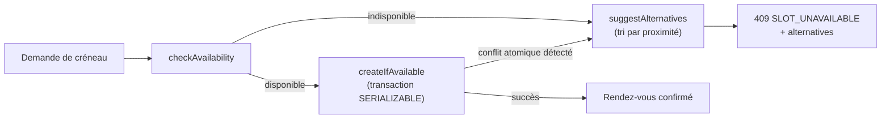

# Journal des modifications

Toutes les évolutions notables du projet **SmartBooking** sont consignées dans ce fichier.

Le format s'appuie sur [Keep a Changelog](https://keepachangelog.com/fr/1.1.0/) et le projet suit le [versionnage sémantique](https://semver.org/lang/fr/) (SemVer : `MAJEUR.MINEUR.CORRECTIF`).

Rubriques employées : **Ajouté** (nouvelles fonctionnalités), **Modifié** (évolutions de comportement existant), **Corrigé** (correctifs de bogues), **Sécurité** (mesures de durcissement).

---

## [1.0.0] - 2026-07-23

Première version stable et livrable du **BLOC 2** de la certification RNCP 39583 « Expert en développement logiciel ». Cette release industrialise la plateforme : conteneurisation, intégration continue, observabilité, documentation complète, accessibilité et sécurité.

### Ajouté

- **Conteneurisation complète** :
  - `Dockerfile` multi-stage pour l'API (`node:22-alpine`, utilisateur non-root `node`, `dumb-init` comme PID 1, `healthcheck`, exécution de `prisma migrate deploy` au démarrage).
  - Build du frontend servi par **nginx** (proxy `/api` vers l'API, fallback SPA, en-têtes de sécurité).
  - `docker-compose.yml` orchestrant les services `db`, `api`, `web`, ainsi que `prometheus` et `grafana` (profil `monitoring`).
- **Intégration et déploiement continus (GitHub Actions)** : jobs `backend` (avec service Postgres), `frontend` et `docker`. Étapes enchaînées : `npm ci`, `prisma generate`, `lint`, `typecheck`, `prisma migrate deploy`, `test:coverage`, `build`, construction des images Docker. `concurrency` avec `cancel-in-progress`.
- **Observabilité** :
  - Logs structurés **Winston** (JSON en production, `requestId` de corrélation).
  - Métriques **Prometheus** via `prom-client` sur `/metrics` (`http_request_duration_seconds`, `http_requests_total`, métriques process par défaut).
  - Sondes de santé `GET /health` (liveness) et `GET /health/ready` (readiness avec ping base de données).
  - Tableaux de bord **Grafana**.
- **Documentation API** : Swagger UI sur `/api/docs` et spécification OpenAPI 3 exposée sur `/api/docs.json`.
- **Accessibilité (RGAA 4.1 + OPQUAST)** : `lang="fr"`, landmarks sémantiques (`header`/`nav`/`main`/`footer`), skip link, focus visible (`:focus-visible`), labels associés (`htmlFor`), `aria-invalid` + `aria-describedby` + `role="alert"` sur les erreurs, `aria-live`/`role="status"` pour l'asynchrone, `aria-pressed` sur la sélection de créneau, textes de boutons explicites, contrastes conformes (`brand #2563eb` sur blanc, au moins 4,5:1), navigation clavier complète, mise en page responsive.
- **Documentation projet complète** : ce journal des modifications, README, guides de démarrage et documentation d'architecture.

### Modifié

- Consolidation de la configuration d'environnement validée par **Zod** (fail-fast au démarrage) avec garde spécifique sur les secrets en production.
- Uniformisation des scripts npm backend (`dev`, `build`, `start`, `typecheck`, `lint`, `format`, `test`, `test:unit`, `test:integration`, `test:coverage`, `prisma:*`, `db:seed`) et frontend (`dev`, `build`, `preview`, `typecheck`, `lint`, `test`).

### Sécurité

Couverture explicite de l'**OWASP Top 10 (2021)** :

| Réf. | Risque | Mesures |
| --- | --- | --- |
| A01 | Contrôle d'accès défaillant | RBAC (CLIENT / PRO / ADMIN) + vérifications de propriété (ownership) |
| A02 | Défaillances cryptographiques | bcrypt (coût 12), refresh token haché SHA-256, cookies `httpOnly`/`secure`/`sameSite` |
| A03 | Injection | Prisma paramétré + validation Zod |
| A04 | Conception non sécurisée | Architecture en couches, délai de prévenance, garde transactionnelle `SERIALIZABLE` |
| A05 | Mauvaise configuration | Helmet, `x-powered-by` désactivé, CORS liste blanche, environnement fail-fast |
| A06 | Composants vulnérables | Dépendances épinglées, images alpine minimales |
| A07 | Authentification défaillante | Rate limiting (global + strict sur l'auth), rotation/révocation des refresh tokens, message de login uniforme, comparaison de hash à temps constant |
| A08 | Intégrité logicielle | CI + lockfiles (`npm ci`) |
| A09 | Journalisation insuffisante | Logs Winston + `requestId`, métriques, `AuditLog` |
| A10 | SSRF | Aucun fetch d'URL fournie par l'utilisateur côté serveur |

---

## [0.4.0] - 2026-07-18

Frontend React accessible et interface complète de prise de rendez-vous.

### Ajouté

- Application **React 18 + TypeScript** bâtie avec **Vite 5** et stylée avec **Tailwind CSS 3**.
- Routage via **React Router 6** et gestion du cache serveur avec **TanStack Query 5**.
- Formulaires avec **React Hook Form + Zod** (validation partagée), appels HTTP via **Axios**, manipulation des dates avec **date-fns**.
- Parcours d'authentification (inscription, connexion) et écrans de gestion de rendez-vous (recherche de créneaux, réservation, proposition d'alternatives).
- Fondations d'accessibilité : landmarks sémantiques, skip link, focus visible, labels associés, restitution des erreurs et des états asynchrones aux lecteurs d'écran, sélection de créneau annoncée via `aria-pressed`.
- Suite de tests frontend **Vitest + Testing Library** (6 tests).

### Modifié

- Le frontend consomme l'API REST via un proxy `/api` (port 5173 en développement).

### Sécurité

- Aucun jeton d'accès stocké de manière persistante : le refresh token repose sur un cookie `httpOnly` géré côté serveur.

---

## [0.3.0] - 2026-07-12

API REST complète exposant l'ensemble des cas d'usage métier.

### Ajouté

- **Authentification** : `POST /api/auth/register`, `/auth/login`, `/auth/refresh`, `/auth/logout`.
- **Utilisateurs** : `GET`/`PATCH /api/users/me`, `POST /api/users/me/password`, `GET /api/users` (ADMIN), `PATCH /api/users/:id` (ADMIN).
- **Professionnels** : `GET /api/professionals`, `/professionals/me`, `/professionals/:id`, `POST /api/professionals`, `PATCH /api/professionals/:id`, `PUT /api/professionals/:id/working-hours`, `POST /api/professionals/:id/time-off`, `DELETE /api/professionals/:id/time-off/:timeOffId`, `GET`/`POST /api/professionals/:professionalId/services`.
- **Services** : `PATCH /api/services/:id`, `DELETE /api/services/:id` (désactivation logique — soft delete).
- **Rendez-vous** : `GET /api/appointments/slots`, `POST /api/appointments/availability`, `POST /api/appointments`, `GET /api/appointments/me`, `GET /api/appointments/professional/:professionalId`, `GET /api/appointments/:id`, `PATCH /api/appointments/:id/reschedule`, `PATCH /api/appointments/:id/status`, `POST /api/appointments/:id/cancel`.
- Cas d'usage applicatifs : `AuthService`, `UserService`, `ProfessionalService`, `ServiceCatalogService`, `AppointmentService`, avec DTO (`toPublicUser` masquant le hash de mot de passe).
- Couche HTTP `interface/http/` : controllers, routes, validators (schémas Zod), middlewares (`authenticate`, `requireRole`, `validateBody`, `errorHandler`, `requestLogger`, `rate-limit`).
- **Composition root** `container.ts` (injection de dépendances) et `createApp(container)` injectable pour les tests.
- Suite de **tests d'intégration** Supertest (16 tests).
- Format d'erreur homogène : objet `error` avec `code`, `message`, `details`. Réservation refusée : `409 SLOT_UNAVAILABLE` avec `details.alternatives` (liste de `start`/`end`).

```json
{
  "error": {
    "code": "SLOT_UNAVAILABLE",
    "message": "Le créneau demandé n'est pas disponible.",
    "details": {
      "alternatives": [
        { "start": "2026-07-24T09:15:00.000Z", "end": "2026-07-24T09:45:00.000Z" },
        { "start": "2026-07-24T10:00:00.000Z", "end": "2026-07-24T10:30:00.000Z" }
      ]
    }
  }
}
```

### Sécurité

- Chaîne d'authentification durcie : access token JWT (15 min) + refresh token opaque rotatif (haché SHA-256 en base, cookie `httpOnly`/`secure`/`sameSite`).
- RBAC (CLIENT / PRO / ADMIN) et vérifications de propriété appliqués au niveau des middlewares et des cas d'usage.
- Rate limiting global et limiteur strict dédié aux routes d'authentification.

---

## [0.2.0] - 2026-07-07

Moteur de planification intelligent (Smart Scheduling Engine) et couverture de tests du domaine.

### Ajouté

- **Value-object `Interval`** (bornes en millisecondes epoch) : `overlaps` (l'adjacence n'est **pas** un conflit → rendez-vous dos à dos possibles), `mergeIntervals`, `subtractIntervals`, `contains`, `durationMinutes`.
- **`availability.service`** :
  - `expandWorkingHours` : horaires hebdomadaires récurrents → intervalles UTC concrets (conversion heure locale/UTC via `Intl.DateTimeFormat`, gestion du fuseau `Europe/Paris` et du changement d'heure/DST par ancrage à midi).
  - `buildFreeIntervals` : ouvertures moins créneaux occupés, avec application de la borne de délai de prévenance.
- **`SchedulingEngine`** (domaine pur, sans I/O, `now` injecté → déterministe) :
  - `checkAvailability` avec raisons granulaires : `PAST`, `LEAD_TIME`, `OUTSIDE_WORKING_HOURS`, `TIME_OFF`, `CONFLICT` (+ ids des rendez-vous en conflit).
  - `listAvailableSlots` : génération d'une grille au pas de 15 minutes.
  - `suggestAlternatives` : créneaux les plus proches d'abord, triés par distance à l'heure désirée.
  - `resolve` : décision finale + alternatives.
- **Anti-double-réservation** : `appointmentRepository.createIfAvailable` et `rescheduleIfAvailable` exécutés en transaction Prisma en isolation `SERIALIZABLE` (re-vérification atomique du chevauchement).
- Hiérarchie d'erreurs de domaine : `AppError` + `NotFound` / `Conflict` / `Validation` / `Unauthorized` / `Forbidden` / `SlotUnavailable`.
- Suite de **47 tests unitaires** du domaine (Vitest).



### Sécurité

- Le moteur reste un domaine pur sans effet de bord ni accès I/O, ce qui limite la surface d'attaque et garantit un comportement déterministe et testable.

---

## [0.1.0] - 2026-07-01

Initialisation du projet, outillage et schéma de données.

### Ajouté

- Monorepo structuré en `backend/` et `frontend/` (dépôt Git `github.com/Sorathia13/ynov-fil-rouge`).
- Socle backend **Node.js 22 + Express 4 + TypeScript (strict)**, organisé en **clean architecture** (`domain/`, `application/`, `infrastructure/`, `interface/http/`) avec règle de dépendance orientée vers le domaine.
- ORM **Prisma 5** sur **PostgreSQL 16**, client Prisma en singleton.
- **Schéma de données** initial : `User`, `RefreshToken`, `Professional`, `Service`, `WorkingHours` (weekday 0-6, minutes depuis minuit), `TimeOff`, `Appointment` (status `PENDING`/`CONFIRMED`/`CANCELLED`/`COMPLETED`), `AuditLog`.
- Migration Prisma initiale et **seed idempotent** (comptes `admin@`, `pro@`, `client@smartbooking.dev`, mot de passe `Password123!`).
- Outillage qualité : **ESLint + Prettier**, TypeScript strict (`noUnusedLocals`, `strictNullChecks`…), configuration d'environnement validée par **Zod** (fail-fast).
- Framework de tests **Vitest** côté backend et frontend.

### Sécurité

- Validation stricte des variables d'environnement au démarrage (fail-fast) avec refus de secrets par défaut en production.

---

[1.0.0]: https://github.com/Sorathia13/ynov-fil-rouge/releases/tag/v1.0.0
[0.4.0]: https://github.com/Sorathia13/ynov-fil-rouge/releases/tag/v0.4.0
[0.3.0]: https://github.com/Sorathia13/ynov-fil-rouge/releases/tag/v0.3.0
[0.2.0]: https://github.com/Sorathia13/ynov-fil-rouge/releases/tag/v0.2.0
[0.1.0]: https://github.com/Sorathia13/ynov-fil-rouge/releases/tag/v0.1.0
