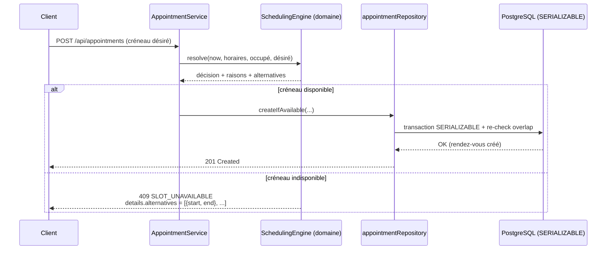

# SmartBooking

> Plateforme SaaS de prise de rendez-vous intelligente. Son cœur est un **moteur de planification** (Smart Scheduling Engine) qui détecte les conflits, empêche les doubles réservations et propose automatiquement les créneaux alternatifs les plus proches.

**État :** `build passing` · `69 tests verts` · `TypeScript strict` · `Docker ready`

Projet fil rouge de la certification **RNCP 39583 — Expert en développement logiciel**, livrable du **BLOC 2 « Concevoir et développer des applications logicielles »**.
Dépôt : [github.com/Sorathia13/ynov-fil-rouge](https://github.com/Sorathia13/ynov-fil-rouge)

---

## Sommaire

- [Fonctionnalités clés](#fonctionnalités-clés)
- [Stack technique](#stack-technique)
- [Architecture](#architecture)
- [Démarrage rapide](#démarrage-rapide)
  - [Avec Docker Compose](#avec-docker-compose)
  - [En développement local](#en-développement-local)
- [Variables d'environnement](#variables-denvironnement)
- [Scripts npm](#scripts-npm)
- [Structure du dépôt](#structure-du-dépôt)
- [Comptes de démonstration](#comptes-de-démonstration)
- [Tests](#tests)
- [Liens utiles](#liens-utiles)
- [Licence](#licence)

---

## Fonctionnalités clés

### Moteur de planification intelligent (Smart Scheduling Engine)

Domaine pur, **sans I/O**, avec l'instant `now` injecté pour être **déterministe** et testable.

- **Détection de conflits** : la valeur `Interval` (millisecondes epoch) porte les opérations `overlaps`, `mergeIntervals`, `subtractIntervals`, `contains`, `durationMinutes`. L'adjacence n'est **pas** un conflit : les rendez-vous dos à dos sont autorisés.
- **Disponibilités** : `expandWorkingHours` transforme des horaires hebdomadaires récurrents en intervalles UTC concrets (conversion locale/UTC via `Intl.DateTimeFormat`, fuseau `Europe/Paris`, gestion du changement d'heure/DST par ancrage à midi). `buildFreeIntervals` calcule « ouvertures moins occupé », en tenant compte du délai de prévenance.
- **Décision granulaire** : `checkAvailability` renvoie des raisons explicites — `PAST`, `LEAD_TIME`, `OUTSIDE_WORKING_HOURS`, `TIME_OFF`, `CONFLICT` (avec les identifiants en conflit).
- **Proposition de créneaux** : `listAvailableSlots` (grille au pas de 15 min), `suggestAlternatives` (les plus proches d'abord, tri par distance à l'heure désirée), `resolve` (décision + alternatives).
- **Anti-double-réservation** : `createIfAvailable` et `rescheduleIfAvailable` s'exécutent dans une **transaction Prisma en isolation `SERIALIZABLE`** avec re-vérification atomique du chevauchement.

### Autres fonctionnalités

- **Authentification & sécurité** : JWT d'accès (15 min) + refresh token opaque rotatif (haché SHA-256 en base, cookie `httpOnly`/`secure`/`sameSite`), `bcrypt` (coût 12), **RBAC** (rôles `CLIENT` / `PRO` / `ADMIN`) + vérifications de propriété (ownership).
- **Gestion des professionnels** : profils, catalogue de services, horaires d'ouverture, indisponibilités (`TimeOff`).
- **Cycle de vie du rendez-vous** : réservation, replanification, changement de statut (`PENDING` / `CONFIRMED` / `CANCELLED` / `COMPLETED`), annulation.
- **Observabilité** : logs structurés (Winston), métriques Prometheus, health checks, tableaux de bord Grafana.
- **API documentée** : Swagger UI et spécification OpenAPI 3.
- **Accessibilité** : conformité visée RGAA 4.1 + OPQUAST (landmarks sémantiques, skip link, focus visible, labels associés, `aria-*`, navigation clavier complète, contrastes ≥ 4,5:1).

---

## Stack technique

| Domaine | Technologies |
| --- | --- |
| **Frontend** | React 18, TypeScript, Vite 5, Tailwind CSS 3, React Router 6, TanStack Query 5, React Hook Form + Zod, Axios, date-fns |
| **Backend** | Node.js 22, Express 4, TypeScript (strict), Prisma 5 ORM, PostgreSQL 16 |
| **Authentification** | JWT (access 15 min), refresh opaque rotatif SHA-256, bcrypt (coût 12), RBAC + ownership |
| **Tests** | Vitest + Supertest (backend), Vitest + Testing Library (frontend) |
| **Qualité** | ESLint, Prettier, TypeScript strict (`noUnusedLocals`, `strictNullChecks`…) |
| **CI/CD** | GitHub Actions (jobs backend / frontend / docker), `concurrency` cancel-in-progress |
| **Conteneurisation** | Dockerfile multi-stage (API `node:22-alpine`, front → nginx), docker-compose |
| **Observabilité** | Winston (logs JSON + requestId), Prometheus (prom-client), Grafana, health checks |
| **Documentation API** | Swagger UI (`/api/docs`), OpenAPI 3 (`/api/docs.json`) |

---

## Architecture

Le backend suit une **clean architecture en couches**, avec la règle de dépendance orientée vers le domaine : `interface` → `application` → `domain`, l'`infrastructure` implémentant les interfaces du domaine. Le fichier `container.ts` joue le rôle de **composition root** (injection de dépendances) ; `createApp(container)` est injectable pour les tests.

```mermaid
flowchart TD
    subgraph Client
        FE["Frontend React 18 / Vite<br/>(nginx en prod, proxy /api)"]
    end

    subgraph API["Backend Express — Clean Architecture"]
        direction TB
        IF["interface/http<br/>controllers · routes · validators (Zod)<br/>middlewares · metrics"]
        APP["application<br/>use-cases · DTO (toPublicUser)"]
        DOM["domain (pur)<br/>entities · value-objects (Interval)<br/>SchedulingEngine · availability.service<br/>repositories (interfaces) · errors"]
        INFRA["infrastructure<br/>config (Zod) · logging (Winston)<br/>auth · prisma · repositories"]

        IF --> APP --> DOM
        INFRA -.implémente.-> DOM
        IF -. container.ts (DI) .- INFRA
    end

    subgraph Données
        PG[("PostgreSQL 16")]
    end

    subgraph Observabilité
        PROM["Prometheus"]
        GRAF["Grafana"]
    end

    FE -->|HTTP /api| IF
    INFRA -->|Prisma 5| PG
    IF -->|/metrics| PROM --> GRAF
```

### Principe du moteur de planification



---

## Démarrage rapide

### Prérequis

- **Docker** + **Docker Compose** (voie recommandée), ou
- **Node.js 22** + **PostgreSQL 16** pour le développement local.

### Avec Docker Compose

Démarre la base de données, l'API et le frontend en une commande :

```bash
docker compose up -d --build
```

| Service | URL | Détail |
| --- | --- | --- |
| Frontend (web) | http://localhost:8080 | nginx, proxy `/api`, fallback SPA |
| API | http://localhost:4000 | Express, migrate deploy au démarrage |
| Base de données | localhost:5432 | PostgreSQL 16 |
| Swagger | http://localhost:4000/api/docs | Documentation OpenAPI |

Profil **monitoring** (Prometheus + Grafana) optionnel :

```bash
docker compose --profile monitoring up -d
# Prometheus : http://localhost:9090
# Grafana    : http://localhost:3001 (admin / admin)
```

### En développement local

```bash
# 1. Backend (port 4000)
cd backend
npm ci
npm run prisma:generate
npm run prisma:migrate:dev   # applique les migrations
npm run db:seed              # comptes de démo idempotents
npm run dev

# 2. Frontend (port 5173, proxy /api → 4000)
cd frontend
npm ci
npm run dev
```

- API : http://localhost:4000
- Frontend : http://localhost:5173

---

## Variables d'environnement

Un fichier `.env.example` est fourni à la racine pour l'orchestration Docker. La configuration backend est **validée par Zod au démarrage** (fail-fast, garde des secrets en production).

### Backend

| Variable | Défaut | Description |
| --- | --- | --- |
| `NODE_ENV` | `development` | `development` / `test` / `production` |
| `PORT` | `4000` | Port d'écoute de l'API |
| `DATABASE_URL` | — | Chaîne de connexion PostgreSQL |
| `JWT_ACCESS_SECRET` | *(dev)* | Secret de signature du token d'accès |
| `JWT_REFRESH_SECRET` | *(dev)* | Secret associé au refresh token |
| `JWT_ACCESS_TTL` | `900` | Durée de vie du token d'accès (secondes) |
| `JWT_REFRESH_TTL` | `604800` | Durée de vie du refresh token (secondes) |
| `CORS_ORIGIN` | `http://localhost:5173` | Origine autorisée (liste blanche) |
| `RATE_LIMIT_WINDOW_MS` | `900000` | Fenêtre du rate limiting global |
| `RATE_LIMIT_MAX` | `300` | Requêtes max par fenêtre (global) |
| `AUTH_RATE_LIMIT_MAX` | `10` | Requêtes max par fenêtre (routes auth) |
| `BCRYPT_ROUNDS` | `12` | Coût bcrypt (10–15) |
| `LOG_LEVEL` | `info` | Niveau de log Winston |
| `MIN_LEAD_MINUTES` | `60` | Délai de prévenance minimal avant réservation |

> En production, l'application refuse de démarrer si les secrets JWT restent sur leurs valeurs par défaut.

### Frontend

| Variable | Défaut | Description |
| --- | --- | --- |
| `VITE_API_URL` | `/api` | URL de base de l'API consommée par le front |

---

## Scripts npm

### Backend (`backend/`)

| Script | Rôle |
| --- | --- |
| `npm run dev` | Serveur de développement (rechargement à chaud) |
| `npm run build` | Compilation TypeScript |
| `npm run start` | Démarrage du build de production |
| `npm run typecheck` | Vérification des types (sans émission) |
| `npm run lint` | Analyse ESLint |
| `npm run format` | Formatage Prettier |
| `npm run test` | Suite de tests complète |
| `npm run test:unit` | Tests unitaires du domaine |
| `npm run test:integration` | Tests d'intégration (Supertest) |
| `npm run test:coverage` | Tests + rapport de couverture |
| `npm run prisma:generate` | Génération du client Prisma |
| `npm run prisma:migrate` | Application des migrations (deploy) |
| `npm run prisma:migrate:dev` | Création/application des migrations (dev) |
| `npm run db:seed` | Seed idempotent (comptes de démo) |

### Frontend (`frontend/`)

| Script | Rôle |
| --- | --- |
| `npm run dev` | Serveur de développement Vite (port 5173) |
| `npm run build` | Build de production |
| `npm run preview` | Prévisualisation du build |
| `npm run typecheck` | Vérification des types |
| `npm run lint` | Analyse ESLint |
| `npm run test` | Tests (Vitest + Testing Library) |

---

## Structure du dépôt

Monorepo `backend/` + `frontend/` :

```
ynov-fil-rouge/
├── backend/
│   ├── prisma/                 # schéma, migrations, seed
│   └── src/
│       ├── domain/             # cœur métier (pur)
│       │   ├── entities/
│       │   ├── value-objects/  # Interval
│       │   ├── services/       # SchedulingEngine, availability.service
│       │   ├── repositories/   # interfaces
│       │   └── errors/         # AppError + variantes
│       ├── application/
│       │   └── use-cases/      # AuthService, AppointmentService…
│       ├── infrastructure/
│       │   ├── config/         # env validé par Zod
│       │   ├── logging/        # Winston
│       │   ├── auth/           # bcrypt, tokens JWT + opaques
│       │   ├── prisma/         # client singleton
│       │   └── repositories/   # implémentations Prisma
│       ├── interface/http/     # controllers, routes, validators, middlewares, metrics
│       ├── docs/               # spécification OpenAPI
│       ├── container.ts        # composition root (DI)
│       ├── app.ts              # createApp(container)
│       └── server.ts
├── frontend/
│   ├── nginx.conf              # proxy /api, fallback SPA, en-têtes de sécurité
│   └── src/
│       ├── api/                # client Axios
│       ├── components/
│       ├── context/
│       ├── hooks/
│       ├── lib/
│       ├── pages/
│       └── test/               # tests Vitest + Testing Library
├── monitoring/                 # prometheus.yml, datasource Grafana
├── docs/                       # documentation projet
├── report/                     # rapport de certification
├── .github/                    # workflows GitHub Actions
├── docker-compose.yml
├── .env.example
├── LICENSE
└── README.md
```

---

## Comptes de démonstration

Créés par le seed idempotent. Mot de passe commun : **`Password123!`**

| Rôle | Email |
| --- | --- |
| `ADMIN` | `admin@smartbooking.dev` |
| `PRO` | `pro@smartbooking.dev` |
| `CLIENT` | `client@smartbooking.dev` |

---

## Tests

**Total vérifié : 69 tests verts.**

| Périmètre | Outils | Nombre |
| --- | --- | --- |
| Backend — unitaires (domaine) | Vitest | 47 |
| Backend — intégration | Vitest + Supertest | 16 |
| Frontend | Vitest + Testing Library | 6 |
| **Total** | | **69** |

```bash
# Backend
cd backend && npm run test:coverage

# Frontend
cd frontend && npm run test
```

La CI GitHub Actions exécute `npm ci`, `prisma generate`, `lint`, `typecheck`, `prisma migrate deploy`, `test:coverage`, `build` puis la construction des images Docker (job backend avec service Postgres, jobs frontend et docker).

---

## Liens utiles

- **Documentation API (Swagger UI)** : [`/api/docs`](http://localhost:4000/api/docs) — spec OpenAPI JSON : `/api/docs.json`
- **Health checks** : `/health` (liveness), `/health/ready` (readiness, ping DB)
- **Métriques Prometheus** : `/metrics`
- **Documentation projet** : [`docs/`](./docs)
- **Rapport de certification** : [`report/`](./report)

---

## Licence

Distribué sous licence **MIT**. Voir le fichier [`LICENSE`](./LICENSE).
