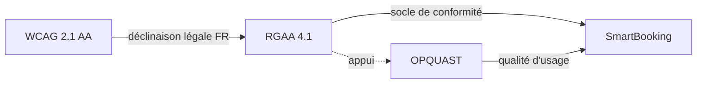
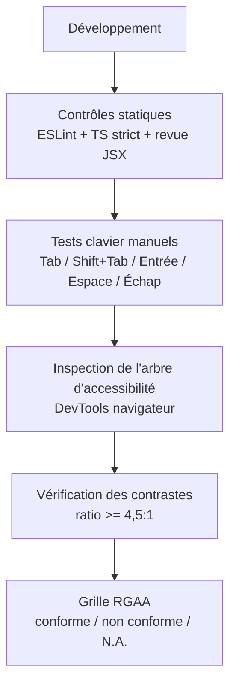

# Accessibilité — SmartBooking

> Compétence visée : **C2.2.3** — Développer une interface utilisateur accessible en respectant les référentiels et normes d'accessibilité en vigueur.

Ce document décrit la démarche d'accessibilité numérique appliquée au frontend de SmartBooking (React 18 + TypeScript + Vite + Tailwind CSS), le référentiel retenu et sa justification, les critères concrètement adressés, la méthode d'évaluation, ainsi que les limites connues et les pistes d'amélioration.

---

## 1. Référentiel choisi et justification

| Référentiel | Statut | Rôle dans le projet |
| --- | --- | --- |
| **RGAA 4.1** (Référentiel Général d'Amélioration de l'Accessibilité) | Obligation légale française | Cadre de conformité principal |
| **OPQUAST** (bonnes pratiques qualité web) | Complément volontaire | Bonnes pratiques d'usage au-delà du strict cadre légal |

### Pourquoi le RGAA 4.1 ?

Le RGAA 4.1 est le **référentiel officiel de l'État français**. Il constitue la déclinaison opérationnelle et la méthode de vérification des **WCAG 2.1 niveau AA** dans le contexte réglementaire français (loi n° 2005-102 du 11 février 2005, article 47, et décret n° 2019-768 du 24 juillet 2019).

Le choisir présente trois avantages :

1. **Conformité légale** : SmartBooking étant une plateforme SaaS française destinée à un usage professionnel (prise de rendez-vous ouverte au public), l'accessibilité relève d'une obligation et non d'une simple bonne intention.
2. **Méthode d'évaluation normée** : le RGAA fournit 106 critères et une grille de test reproductible (conforme / non conforme / non applicable), ce qui rend l'audit objectif et traçable.
3. **Alignement international** : conforme au RGAA ⇒ conforme aux WCAG 2.1 AA, socle reconnu au niveau européen (directive UE 2016/2102) et mondial.

### Pourquoi compléter par OPQUAST ?

Le RGAA fixe le **plancher légal** (« l'interface est-elle utilisable par tous ? »). OPQUAST ajoute une couche de **qualité d'expérience** (« l'interface est-elle claire, robuste et fiable pour tous ? ») : intitulés de boutons explicites, cohérence des messages d'état, robustesse des formulaires, prévisibilité de la navigation. Ces bonnes pratiques renforcent l'accessibilité réelle sans se substituer au référentiel légal.



---

## 2. Les 4 principes POUR

Le RGAA (comme les WCAG) organise l'accessibilité autour de quatre principes fondamentaux. Les tableaux suivants recensent, principe par principe, ce qui est **réellement mis en œuvre** dans SmartBooking, avec le mécanisme et l'extrait de code associés.

### 2.1 Perceptible

L'information et les composants de l'interface doivent être présentés de façon perceptible par l'utilisateur.

| Critère RGAA | Mise en œuvre concrète | Mécanisme / extrait |
| --- | --- | --- |
| Langue de la page (8.3) | Langue déclarée `fr` sur `<html>` | `<html lang="fr">` |
| Contrastes (3.2 / 3.3) | Couleur de marque `#2563eb` sur fond blanc ⇒ ratio ≥ **4,5:1** (texte normal) | Palette Tailwind, jeton `brand` |
| Structuration visible de l'information | Landmarks sémantiques (`header`, `nav`, `main`, `footer`) porteurs de sens | voir §2.2 |
| État de sélection perceptible | Créneau sélectionné signalé visuellement **et** vocalement | `aria-pressed` (voir §2.4) |

**Langue de la page** (`index.html`) :

```html
<!doctype html>
<html lang="fr">
  <head>
    <meta charset="UTF-8" />
    <meta name="viewport" content="width=device-width, initial-scale=1.0" />
    <title>SmartBooking — Prise de rendez-vous intelligente</title>
  </head>
  <body>
    <div id="root"></div>
    <script type="module" src="/src/main.tsx"></script>
  </body>
</html>
```

**Contraste** — le jeton `brand` (`#2563eb`) sur blanc atteint un ratio d'environ **4,54:1**, conforme au seuil AA pour le texte de taille normale. Il est utilisé pour les libellés d'action, les liens et les focus.

```js
// tailwind.config.js — jeton de couleur de marque
export default {
  theme: {
    extend: {
      colors: {
        brand: {
          DEFAULT: '#2563eb', // ratio >= 4,5:1 sur blanc
        },
      },
    },
  },
};
```

### 2.2 Utilisable

Les composants et la navigation doivent être utilisables (au clavier notamment).

| Critère RGAA | Mise en œuvre concrète | Mécanisme / extrait |
| --- | --- | --- |
| Lien d'évitement (12.7) | « Aller au contenu » en première position, ciblant `#main` | `<a href="#main" className="skip-link">` |
| Landmarks / zones (12.6) | `header` / `nav` / `main` / `footer` structurent chaque page | balises sémantiques natives |
| Prise de focus visible (10.7) | Contour de focus systématique via `:focus-visible` | CSS global |
| Navigation au clavier (12.x) | Tous les éléments interactifs sont des `<button>`, `<a>`, `<input>` natifs, atteignables et activables au clavier | pas de `div` cliquable |

**Lien d'évitement + landmarks** (composant de mise en page racine) :

```tsx
export function AppLayout({ children }: { children: React.ReactNode }) {
  return (
    <>
      <a href="#main" className="skip-link">
        Aller au contenu principal
      </a>

      <header>
        <nav aria-label="Navigation principale">
          {/* liens de navigation */}
        </nav>
      </header>

      <main id="main" tabIndex={-1}>
        {children}
      </main>

      <footer>{/* mentions, liens utiles */}</footer>
    </>
  );
}
```

**Focus visible** — on n'affiche jamais `outline: none` sans remplacement. Le style s'appuie sur `:focus-visible` afin de ne montrer le contour qu'à la navigation clavier, sans le forcer au clic souris :

```css
/* index.css */
.skip-link {
  position: absolute;
  left: -999px;
  top: 0;
  background: #2563eb;
  color: #fff;
  padding: 0.5rem 1rem;
  z-index: 100;
}
.skip-link:focus {
  left: 0; /* réapparaît à la prise de focus clavier */
}

:focus-visible {
  outline: 2px solid #2563eb;
  outline-offset: 2px;
}
```

### 2.3 Compréhensible

Les informations et le fonctionnement de l'interface doivent être compréhensibles.

| Critère RGAA | Mise en œuvre concrète | Mécanisme / extrait |
| --- | --- | --- |
| Étiquettes de champ (11.1 / 11.2) | Chaque `<input>` est associé à un `<label>` via `htmlFor`/`id` | voir extrait formulaire |
| Erreurs de saisie signalées (11.10) | Champ en erreur : `aria-invalid` + message lié par `aria-describedby` + `role="alert"` | voir extrait formulaire |
| Suggestion de correction (11.10) | Messages d'erreur issus des schémas Zod, explicites et localisés | React Hook Form + Zod |
| Intitulés de contrôle explicites | Textes de boutons décrivant l'action (« Réserver ce créneau », pas « OK ») | bonne pratique OPQUAST |
| Restitution des changements d'état asynchrones | Chargements / résultats annoncés par `aria-live` / `role="status"` | voir §2.4 |

**Formulaire accessible** (connexion — labels, `aria-invalid`, `aria-describedby`, `role="alert"`) :

```tsx
export function LoginForm() {
  const {
    register,
    handleSubmit,
    formState: { errors, isSubmitting },
  } = useForm<LoginInput>({ resolver: zodResolver(loginSchema) });

  return (
    <form onSubmit={handleSubmit(onSubmit)} noValidate>
      <div>
        <label htmlFor="email">Adresse e-mail</label>
        <input
          id="email"
          type="email"
          autoComplete="email"
          aria-invalid={errors.email ? true : undefined}
          aria-describedby={errors.email ? 'email-error' : undefined}
          {...register('email')}
        />
        {errors.email && (
          <p id="email-error" role="alert">
            {errors.email.message}
          </p>
        )}
      </div>

      <div>
        <label htmlFor="password">Mot de passe</label>
        <input
          id="password"
          type="password"
          autoComplete="current-password"
          aria-invalid={errors.password ? true : undefined}
          aria-describedby={errors.password ? 'password-error' : undefined}
          {...register('password')}
        />
        {errors.password && (
          <p id="password-error" role="alert">
            {errors.password.message}
          </p>
        )}
      </div>

      <button type="submit" disabled={isSubmitting}>
        {isSubmitting ? 'Connexion en cours…' : 'Se connecter'}
      </button>
    </form>
  );
}
```

Points clés :

- **`htmlFor` ⇄ `id`** : le clic sur le label déplace le focus dans le champ, et le lecteur d'écran énonce l'étiquette à la prise de focus.
- **`aria-invalid`** : positionné uniquement en cas d'erreur (`undefined` sinon, pour ne pas polluer l'arbre d'accessibilité).
- **`aria-describedby`** : relie le champ à son message d'erreur, restitué par le lecteur d'écran après le libellé.
- **`role="alert"`** : le message est annoncé immédiatement dès son apparition, sans que l'utilisateur ait à le rechercher.
- **`noValidate`** : on désactive la validation navigateur pour garder une restitution homogène pilotée par Zod (messages en français, cohérents).

### 2.4 Robuste

Le contenu doit être suffisamment robuste pour être interprété de façon fiable par les technologies d'assistance.

| Critère RGAA | Mise en œuvre concrète | Mécanisme / extrait |
| --- | --- | --- |
| Compatibilité technologies d'assistance (8.x) | HTML valide, éléments natifs, ARIA employé en complément et non en substitution | React + JSX typé |
| État des composants restitué | Sélection d'un créneau exposée via `aria-pressed` | voir extrait créneaux |
| Régions dynamiques (RGAA 7 / WAI-ARIA) | Résultats asynchrones (recherche de disponibilités, alternatives) annoncés via `aria-live` / `role="status"` | voir extrait |
| Responsive (13 / OPQUAST) | Mise en page fluide, sans perte d'information ni scroll horizontal | classes utilitaires Tailwind |

**Sélection de créneau + région live** (moteur de planification côté UI) :

```tsx
export function SlotPicker({ slots, selected, onSelect, isLoading }: SlotPickerProps) {
  return (
    <section aria-labelledby="slots-heading">
      <h2 id="slots-heading">Créneaux disponibles</h2>

      {/* Annonce vocale de l'état asynchrone */}
      <p role="status" aria-live="polite">
        {isLoading
          ? 'Recherche des créneaux disponibles…'
          : `${slots.length} créneau(x) disponible(s)`}
      </p>

      <ul>
        {slots.map((slot) => {
          const isSelected = selected?.start === slot.start;
          return (
            <li key={slot.start}>
              <button
                type="button"
                aria-pressed={isSelected}
                onClick={() => onSelect(slot)}
              >
                {formatTimeRange(slot.start, slot.end)}
              </button>
            </li>
          );
        })}
      </ul>
    </section>
  );
}
```

Points clés :

- **`aria-pressed`** : le bouton de créneau se comporte comme un bouton bascule ; son état sélectionné/non sélectionné est restitué vocalement, en plus du style visuel.
- **`aria-live="polite"` + `role="status"`** : lors d'une réservation refusée (réponse `409 SLOT_UNAVAILABLE` avec `details.alternatives`), la liste des créneaux alternatifs proposés par le moteur de planification est annoncée sans voler le focus ni interrompre l'utilisateur.
- **Éléments natifs** : les créneaux sont de vrais `<button>` dans une `<ul>`, garantissant tabulation, activation clavier (Entrée/Espace) et sémantique de liste corrects.

---

## 3. Synthèse des mécanismes par technique

| Technique | Where | Bénéfice utilisateur |
| --- | --- | --- |
| `lang="fr"` | `index.html` | Prononciation correcte par la synthèse vocale |
| Landmarks (`header`/`nav`/`main`/`footer`) | `AppLayout` | Navigation par régions (lecteur d'écran) |
| Lien d'évitement | `AppLayout` | Saut direct au contenu au clavier |
| `:focus-visible` | `index.css` | Repérage du focus clavier sans gêner la souris |
| `label` + `htmlFor` | formulaires | Association champ/étiquette |
| `aria-invalid` + `aria-describedby` + `role="alert"` | formulaires | Signalement et restitution des erreurs |
| `aria-live` / `role="status"` | recherche de créneaux | Restitution des mises à jour asynchrones |
| `aria-pressed` | sélection de créneau | État de bascule restitué |
| Contraste `#2563eb` ≥ 4,5:1 | jeton `brand` | Lisibilité |
| Responsive Tailwind | ensemble | Utilisabilité multi-supports, zoom |

---

## 4. Méthode d'évaluation

L'accessibilité est vérifiée en combinant plusieurs approches, du développement jusqu'à la revue :



| Étape | Outil / méthode | Ce qui est vérifié |
| --- | --- | --- |
| Contrôles statiques | ESLint, TypeScript strict, revue de code | Éléments natifs, présence des attributs ARIA et des `label` |
| Tests au clavier | Manuel (Tab, Shift+Tab, Entrée, Espace, Échap) | Ordre de tabulation logique, focus visible, activation |
| Arbre d'accessibilité | Outils de développement navigateur (onglet Accessibility) | Rôles, noms accessibles, états (`pressed`, `invalid`) |
| Contrastes | Vérification des ratios couleur | Seuil AA (≥ 4,5:1 texte normal) |
| Restitution vocale | Test ponctuel avec lecteur d'écran | Annonce des erreurs et des régions live |
| Conformité RGAA | Grille de critères | Statut par critère, traçabilité |

---

## 5. Limites connues et pistes d'amélioration

L'accessibilité est une démarche continue. Les points suivants sont identifiés comme axes de progression :

| Limite actuelle | Piste d'amélioration | Bénéfice attendu |
| --- | --- | --- |
| Pas d'audit automatisé intégré à la CI | Intégrer **axe-core** (via `@axe-core/react` en dev et `vitest-axe` dans les tests) | Détection systématique des régressions d'accessibilité à chaque build |
| Tests lecteurs d'écran ponctuels | Campagne de tests structurée **NVDA** (Windows), **VoiceOver** (macOS/iOS) et TalkBack (Android) | Validation réelle du parcours de bout en bout |
| Couverture de test frontend limitée (6 tests) | Ajouter des tests d'accessibilité ciblés (rôles, noms accessibles, états ARIA) via Testing Library | Non-régression sur les composants critiques |
| Absence de déclaration de conformité formelle | Rédiger et publier une **déclaration de conformité RGAA** (taux de conformité, dérogations, schéma pluriannuel) | Obligation légale et transparence vis-à-vis des utilisateurs |
| Audit de conformité complet non finalisé | Réaliser un audit RGAA exhaustif sur les 106 critères (idéalement par un tiers) | Mesure objective du taux de conformité |

### Piste — audit automatisé avec axe-core

Exemple d'intégration dans les tests (Vitest + Testing Library) pour détecter automatiquement les violations sur un composant :

```tsx
import { render } from '@testing-library/react';
import { axe } from 'vitest-axe';
import { LoginForm } from './LoginForm';

it("le formulaire de connexion n'a pas de violation d'accessibilité", async () => {
  const { container } = render(<LoginForm />);
  const results = await axe(container);
  expect(results.violations).toHaveLength(0);
});
```

### Piste — déclaration de conformité

À terme, publier une page « Accessibilité » indiquant :

- le référentiel appliqué (RGAA 4.1) et le niveau visé (AA) ;
- le taux de conformité mesuré et la date de l'audit ;
- les contenus non accessibles et les éventuelles dérogations pour charge disproportionnée ;
- un moyen de contact pour signaler un défaut d'accessibilité et exercer un recours.

---

## 6. En résumé

SmartBooking construit son accessibilité sur un **socle légal (RGAA 4.1)** renforcé par des **bonnes pratiques qualité (OPQUAST)**. Les quatre principes POUR sont adressés par des mécanismes concrets et éprouvés — langue déclarée, landmarks sémantiques, lien d'évitement, focus visible, labels associés, gestion accessible des erreurs (`aria-invalid` / `aria-describedby` / `role="alert"`), régions live pour l'asynchrone, `aria-pressed` sur la sélection de créneau, contrastes conformes et mise en page responsive. L'évaluation combine contrôles statiques, tests clavier et inspection de l'arbre d'accessibilité. Les pistes prioritaires portent sur l'automatisation (axe-core en CI), les tests lecteurs d'écran et la publication d'une déclaration de conformité.
