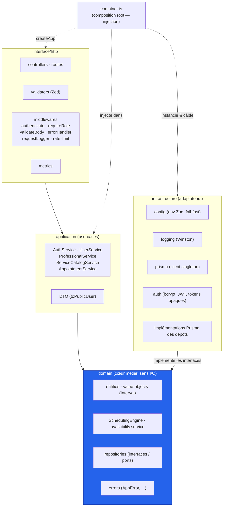
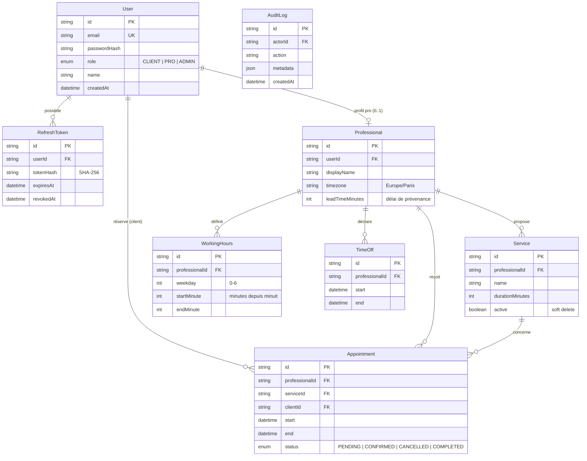
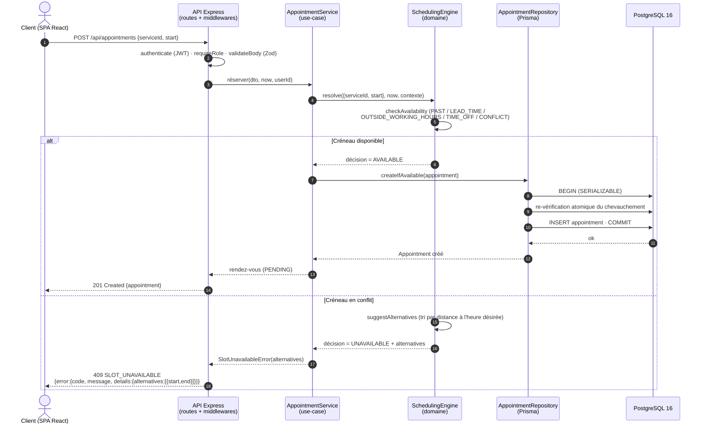

# Document d'architecture logicielle — SmartBooking

> Référentiel : Certification RNCP 39583 « Expert en développement logiciel »
> Bloc 2 « Concevoir et développer des applications logicielles »
> Compétence associée : **C2.2.1** (conception de l'architecture logicielle)
> Dépôt : `github.com/Sorathia13/ynov-fil-rouge` — monorepo `backend/` + `frontend/`

## 1. Objet du document

Ce document décrit l'architecture de **SmartBooking**, plateforme SaaS de prise de rendez-vous intelligente. Il présente la vue d'ensemble en trois tiers, l'architecture en couches du backend (clean architecture), le modèle de données, le flux d'une réservation, puis justifie les choix au regard de la **maintenabilité**, de l'**extensibilité** et de la **sécurité**, ainsi que le choix des formalismes de modélisation.

La fonctionnalité phare est le **moteur de planification intelligent** (*Smart Scheduling Engine*) : il détecte les conflits de planning, empêche les doubles réservations et propose automatiquement les créneaux alternatifs les plus proches de l'heure souhaitée.

## 2. Vue d'ensemble : architecture 3-tiers

SmartBooking suit une architecture classique en trois tiers, avec une séparation stricte entre présentation, logique métier et persistance.

| Tier | Rôle | Technologies |
| --- | --- | --- |
| **Présentation** (client) | SPA servie au navigateur, rendu, formulaires, navigation, appels HTTP à l'API. | React 18, TypeScript, Vite 5, Tailwind CSS 3, React Router 6, TanStack Query 5, React Hook Form + Zod, Axios, date-fns |
| **Application / logique métier** (serveur) | API REST, authentification, RBAC, orchestration des cas d'usage, moteur de planification. | Node.js 22, Express 4, TypeScript (strict), Prisma 5 |
| **Données** (persistance) | Stockage relationnel des utilisateurs, professionnels, disponibilités et rendez-vous. | PostgreSQL 16 |

En production, le frontend est compilé en fichiers statiques servis par **nginx**, qui joue aussi le rôle de reverse proxy : il route `/api` vers l'API Node, assure le *fallback* SPA (toute route inconnue renvoyée vers `index.html`) et applique des en-têtes de sécurité.

```mermaid
flowchart LR
    subgraph Tier1["Tier Présentation"]
        B["Navigateur<br/>SPA React 18 / Vite"]
    end
    subgraph Edge["nginx (reverse proxy)"]
        N["Statique SPA<br/>+ proxy /api<br/>+ en-têtes sécurité"]
    end
    subgraph Tier2["Tier Application"]
        API["API Express 4<br/>Node.js 22 / TS strict<br/>Smart Scheduling Engine"]
    end
    subgraph Tier3["Tier Données"]
        DB[("PostgreSQL 16")]
    end
    OBS["Prometheus / Grafana"]

    B -->|HTTPS| N
    N -->|/ (SPA)| B
    N -->|/api| API
    API -->|Prisma 5| DB
    API -.->|/metrics| OBS
```

L'infrastructure d'exécution est décrite via **docker-compose** avec les services `db`, `api`, `web`, et — sous le profil `monitoring` — `prometheus` et `grafana`.

## 3. Architecture en couches du backend (clean architecture)

Le backend applique une **architecture en couches** conforme aux principes de la *clean architecture*. La **règle de dépendance** est stricte : les dépendances pointent toujours vers l'intérieur, c'est-à-dire vers le **domaine**. Le domaine ne connaît ni Express, ni Prisma, ni aucune préoccupation d'infrastructure ; il définit des **interfaces** (ports) que l'infrastructure implémente (adaptateurs).

### 3.1 Responsabilités des couches

| Couche | Répertoire | Responsabilités | Dépend de |
| --- | --- | --- | --- |
| **Domaine** | `domain/` | Entités, *value objects* (`Interval`), services métier (`SchedulingEngine`, `availability.service`), interfaces de dépôts (repositories), erreurs (`AppError` + `NotFound` / `Conflict` / `Validation` / `Unauthorized` / `Forbidden` / `SlotUnavailable`). Aucune I/O. | (rien) |
| **Application** | `application/` | Cas d'usage orchestrant le domaine : `AuthService`, `UserService`, `ProfessionalService`, `ServiceCatalogService`, `AppointmentService`. DTO (`toPublicUser` masque le hash du mot de passe). | Domaine |
| **Infrastructure** | `infrastructure/` | Détails techniques : `config` (env validé par Zod, *fail-fast* + garde des secrets en prod), `logging` (Winston), `prisma` (client singleton), `auth` (bcrypt, tokens JWT + opaques), implémentations Prisma des dépôts. | Domaine (implémente ses interfaces) |
| **Interface HTTP** | `interface/http/` | Adaptateur d'entrée : controllers, routes, validators (schémas Zod), middlewares (`authenticate`, `requireRole`, `validateBody`, `errorHandler`, `requestLogger`, `rate-limit`), exposition des métriques. | Application |

### 3.2 Inversion de dépendances via `container.ts`

Le fichier `container.ts` est la **composition root** : il instancie les implémentations concrètes (dépôts Prisma, services techniques), câble les cas d'usage sur les interfaces du domaine, puis expose le tout. La fonction `createApp(container)` reçoit ce conteneur par injection, ce qui rend l'application **injectable** et donc **testable** : les tests peuvent fournir un conteneur alternatif sans démarrer l'infrastructure réelle.

Ce mécanisme réalise concrètement l'**inversion de dépendances** : le domaine déclare le besoin (`interface AppointmentRepository`), l'infrastructure fournit la réalisation (`PrismaAppointmentRepository`), et le conteneur effectue la liaison au démarrage. Aucune couche interne ne référence une couche externe.

### 3.3 Diagramme des couches et de la règle de dépendance



La flèche « infrastructure → domaine » traduit la règle de dépendance : même la couche la plus technique dépend du domaine (en implémentant ses interfaces), jamais l'inverse.

## 4. Le moteur de planification

Le moteur est un **domaine pur, sans I/O**. L'instant courant (`now`) lui est **injecté**, ce qui le rend **déterministe** et donc facilement testable.

| Composant | Rôle |
| --- | --- |
| **`Interval`** (ms epoch) | `overlaps` (l'adjacence n'est **pas** un conflit → rendez-vous dos à dos possibles), `mergeIntervals`, `subtractIntervals`, `contains`, `durationMinutes`. |
| **`availability.service`** | `expandWorkingHours` : horaires hebdomadaires récurrents → intervalles UTC concrets (conversion heure locale ⇄ UTC via `Intl.DateTimeFormat`, fuseau `Europe/Paris`, gestion du changement d'heure / DST par ancrage à midi). `buildFreeIntervals` : ouvertures moins créneaux occupés, avec borne de délai de prévenance. |
| **`SchedulingEngine`** | `checkAvailability` (raisons granulaires : `PAST`, `LEAD_TIME`, `OUTSIDE_WORKING_HOURS`, `TIME_OFF`, `CONFLICT` + ids en conflit), `listAvailableSlots` (grille au pas de 15 min), `suggestAlternatives` (les plus proches d'abord, tri par distance à l'heure désirée), `resolve` (décision + alternatives). |

**Anti-double-réservation.** La décision du moteur (calcul en mémoire) ne suffit pas à garantir l'exclusivité sous concurrence. La garantie forte est apportée au niveau de la persistance : `appointmentRepository.createIfAvailable` et `rescheduleIfAvailable` s'exécutent dans une **transaction Prisma en isolation `SERIALIZABLE`**, avec **re-vérification atomique du chevauchement** avant l'écriture. Deux requêtes concurrentes sur le même créneau ne peuvent donc pas aboutir toutes les deux.

## 5. Modèle de données

Le schéma est géré par **Prisma** sur **PostgreSQL 16** (migration initiale + *seed* idempotent). Entités : `User`, `RefreshToken`, `Professional`, `Service`, `WorkingHours`, `TimeOff`, `Appointment`, `AuditLog`.



> `WorkingHours` stocke `weekday` (0–6) et des minutes depuis minuit ; la conversion en instants UTC concrets est réalisée par `expandWorkingHours` (fuseau `Europe/Paris`, DST). La désactivation d'un `Service` est un **soft delete** (`active = false`), ce qui préserve l'historique des rendez-vous liés.

Comptes de démonstration issus du *seed* : `admin@`, `pro@`, `client@smartbooking.dev` (mot de passe `Password123!`).

## 6. Flux d'une réservation (diagramme de séquence)

Le scénario ci-dessous couvre à la fois le cas nominal et le **cas de conflit** avec proposition d'alternatives. La réponse en cas de refus est un **`409 SLOT_UNAVAILABLE`** dont `details.alternatives` contient une liste de `start` / `end`.



Ce diagramme illustre la **double barrière** anti-double-réservation : décision applicative par le moteur, puis garantie transactionnelle `SERIALIZABLE` à l'écriture. Le cas de conflit renvoie systématiquement des alternatives exploitables directement par l'interface.

## 7. Justification des choix d'architecture

### 7.1 Maintenabilité

- **Séparation des préoccupations.** Chaque couche a une responsabilité unique et des frontières explicites ; un changement d'ORM ou de framework HTTP n'impacte pas le domaine.
- **Domaine pur et déterministe.** Le moteur de planification, sans I/O et avec `now` injecté, est testable de façon isolée et reproductible (47 tests unitaires du domaine).
- **Qualité outillée.** TypeScript en mode `strict` (`noUnusedLocals`, `strictNullChecks`…), ESLint + Prettier, et une **CI GitHub Actions** (jobs backend avec service Postgres, frontend, docker) enchaînant `npm ci`, `prisma generate`, lint, typecheck, `prisma migrate deploy`, `test:coverage`, build et construction des images Docker (`concurrency: cancel-in-progress`).
- **Couverture de test vérifiée.** 63 tests backend (47 unitaires + 16 d'intégration via Supertest) et 6 tests frontend (Testing Library), soit **69 tests verts**.
- **Observabilité intégrée.** Logs structurés JSON Winston avec `requestId` de corrélation, métriques Prometheus (`http_request_duration_seconds`, `http_requests_total`, métriques process), health checks `/health` (liveness) et `/health/ready` (readiness, ping DB), tableaux de bord Grafana. Le diagnostic en production est ainsi facilité.

### 7.2 Extensibilité

- **Ports & adaptateurs.** Les interfaces de dépôts dans le domaine permettent d'ajouter une implémentation (autre base, cache, service externe) sans toucher aux cas d'usage.
- **Composition root injectable.** `container.ts` centralise le câblage ; ajouter un cas d'usage ou substituer une implémentation se fait en un point unique, et `createApp(container)` autorise des variantes (tests, environnements).
- **Moteur ouvert à l'évolution.** La grille de créneaux (pas de 15 min), les raisons d'indisponibilité granulaires et la stratégie de suggestion d'alternatives sont encapsulées dans le domaine et peuvent évoluer sans effet de bord sur l'API.
- **API documentée et contractualisée.** Spécification **OpenAPI 3** (`/api/docs.json`) et **Swagger UI** (`/api/docs`) : le contrat d'interface est explicite pour les intégrateurs et les évolutions.
- **Validation par schémas Zod** réutilisables côté frontend et backend, réduisant le coût d'ajout de nouveaux champs ou endpoints.

### 7.3 Sécurité

L'architecture intègre les mesures OWASP Top 10 (2021) au niveau des couches concernées :

| Risque | Mesure | Localisation |
| --- | --- | --- |
| A01 Contrôle d'accès | RBAC (`CLIENT` / `PRO` / `ADMIN`) + vérifications de propriété (ownership) | `interface/http` (`requireRole`) + use-cases |
| A02 Cryptographie | bcrypt (coût 12), refresh token opaque haché SHA-256 en base, cookie `httpOnly`/`secure`/`sameSite` | `infrastructure/auth` |
| A03 Injection | Prisma paramétré + validation Zod systématique | infrastructure + `validators` |
| A04 Conception non sûre | Archi en couches, délai de prévenance, garde transactionnelle `SERIALIZABLE` | domaine + repositories |
| A05 Mauvaise configuration | Helmet, `x-powered-by` désactivé, CORS liste blanche, env `fail-fast` (Zod) | `interface/http` + `config` |
| A06 Composants vulnérables | Dépendances épinglées (lockfiles), images alpine minimales | build / Docker |
| A07 Authentification | Rate limiting (global + strict sur l'auth), rotation/révocation des refresh tokens, message de login uniforme, comparaison de hash à temps constant | middlewares + `auth` |
| A08 Intégrité | CI + `npm ci` (lockfiles) | CI/CD |
| A09 Journalisation | Logs Winston + `requestId`, métriques, `AuditLog` | infrastructure + domaine |
| A10 SSRF | Aucune récupération d'URL fournie par l'utilisateur côté serveur | conception |

La conteneurisation renforce cette posture : **Dockerfile multi-stage** (API sur `node:22-alpine`, utilisateur non-root `node`, `dumb-init`, healthcheck, `migrate deploy` au démarrage) et frontend servi par nginx avec en-têtes de sécurité.

## 8. Choix des formalismes de modélisation

| Formalisme | Usage dans ce document | Justification |
| --- | --- | --- |
| **Diagramme 3-tiers / de composants** (mermaid `flowchart`) | Vue d'ensemble présentation / application / données et couches backend | Rend visible la séparation des responsabilités et la règle de dépendance vers le domaine. |
| **Diagramme entité-association** (mermaid `erDiagram`) | Modèle de données Prisma / PostgreSQL | Formalisme standard pour un schéma relationnel : entités, attributs, cardinalités. Fidèle au schéma Prisma réel. |
| **Diagramme de séquence** (mermaid `sequenceDiagram`) | Flux d'une réservation, cas nominal et cas de conflit | Met en évidence l'ordre des interactions et les deux barrières anti-double-réservation (décision moteur + transaction `SERIALIZABLE`). |

Le choix de **Mermaid** est délibéré : les diagrammes sont décrits **en texte**, versionnés dans Git aux côtés du code, revus en *pull request* et rendus nativement par les plateformes (GitHub, éditeurs Markdown). La documentation reste ainsi **synchronisée avec le code** et évite la dérive propre aux images binaires exportées d'un outil tiers.

---

*Document relié à la compétence C2.2.1 — architecture logicielle de SmartBooking.*
