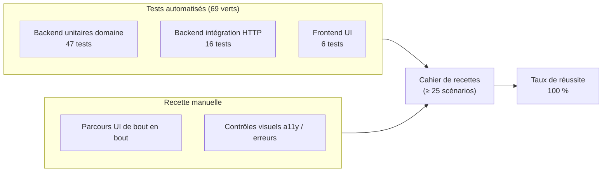
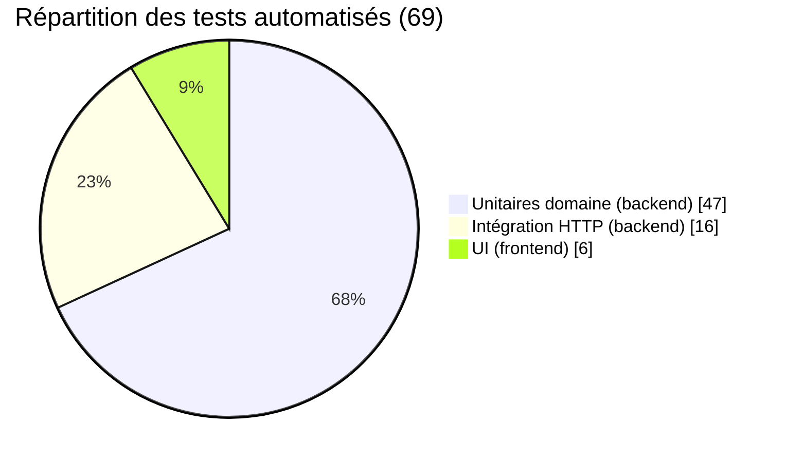

# Cahier de recettes — SmartBooking

> Certification RNCP 39583 « Expert en développement logiciel »
> BLOC 2 — Concevoir et développer des applications logicielles
> Compétence **C2.3.1** — Élaboration du cahier de recettes (livrable **ÉLIMINATOIRE**)
> Dépôt : `github.com/Sorathia13/ynov-fil-rouge`

---

## 1. Introduction

### 1.1 Objectif

Ce cahier de recettes formalise la **stratégie de validation** de la plateforme SmartBooking et **trace la preuve** que chaque exigence fonctionnelle, structurelle et de sécurité est couverte par un scénario de test reproductible. Il constitue le référentiel de recette applicative : chaque scénario porte un identifiant, un objectif, des préconditions, des étapes, un jeu de données, un résultat attendu, un résultat obtenu et un statut (OK/KO).

Il démontre notamment le bon fonctionnement de la **fonctionnalité phare** : le *Smart Scheduling Engine* (moteur de planification intelligent) qui détecte les conflits de planning, empêche les doubles réservations et propose automatiquement les créneaux alternatifs les plus proches.

### 1.2 Périmètre

| Inclus dans la recette | Exclu de la recette |
| --- | --- |
| Parcours d'authentification (inscription, connexion, refresh, logout) | Tests de charge / performance (hors périmètre certification) |
| Consultation des créneaux et disponibilités | Compatibilité multi-navigateurs exhaustive (validé Chromium/Firefox) |
| Réservation, gestion des conflits et alternatives | Intégrations de paiement (non implémentées) |
| Annulation et reprogrammation | Notifications e-mail (non implémentées) |
| Gestion des prestations (services) et des horaires | |
| Tableau de bord (client / professionnel) | |
| Contrôles structurels (validation, RBAC, format d'erreur) | |
| Contrôles de sécurité (OWASP Top 10 2021) | |

### 1.3 Environnement de test

| Élément | Valeur |
| --- | --- |
| Backend | Node.js 22, Express 4, TypeScript strict, Prisma 5, PostgreSQL 16 |
| Frontend | React 18, TypeScript, Vite 5, Tailwind 3, TanStack Query 5 |
| Outils de test backend | Vitest + Supertest |
| Outils de test frontend | Vitest + Testing Library |
| Base de données de test | PostgreSQL 16 (service dédié en CI GitHub Actions) |
| Déterminisme | Domaine pur, horloge `now` injectée → résultats reproductibles |
| Comptes de démonstration | `admin@smartbooking.dev`, `pro@smartbooking.dev`, `client@smartbooking.dev` — mot de passe `Password123!` |
| Démarrage conteneurisé | `docker compose up -d --build` (db + api + web) |
| Démarrage local | Backend `npm run dev` (port 4000) — Frontend `npm run dev` (port 5173, proxy `/api`) |
| Documentation API vérifiable | Swagger UI `/api/docs`, OpenAPI 3 `/api/docs.json` |

### 1.4 Modalités d'exécution

```bash
# Backend — suite complète avec couverture
cd backend
npm ci
npm run prisma:generate
npm run prisma:migrate      # migrate deploy
npm run test:coverage       # 47 unitaires domaine + 16 intégration = 63 tests

# Frontend
cd frontend
npm ci
npm run test                # 6 tests
```

Chaque scénario ci-dessous précise sa **nature** :

- **Automatisé (backend)** : couvert par les 63 tests Vitest/Supertest.
- **Automatisé (frontend)** : couvert par les 6 tests Vitest/Testing Library.
- **Manuel** : rejoué à la main via l'UI ou un client HTTP (curl / Swagger UI) lors de la recette.

### 1.5 Convention de statut

| Statut | Signification |
| --- | --- |
| **OK** | Résultat obtenu conforme au résultat attendu. |
| **KO** | Écart constaté (bloquant à corriger avant livraison). |

---

## 2. Vue d'ensemble du dispositif de test



Correspondance de haut niveau avec l'architecture testée :

| Couche testée | Où | Type de test |
| --- | --- | --- |
| `domain/` (Interval, availability.service, SchedulingEngine) | 47 tests unitaires | Automatisé backend |
| `interface/http` (routes, validators, middlewares) | 16 tests d'intégration Supertest | Automatisé backend |
| Composants et formulaires React | 6 tests Testing Library | Automatisé frontend |
| Parcours utilisateur complet | Recette manuelle | Manuel |

---

## 3. Famille 1 — Tests FONCTIONNELS

Les scénarios valident les parcours métier de bout en bout.

| ID | Objectif | Préconditions | Étapes | Données | Résultat attendu | Résultat obtenu | Statut |
| --- | --- | --- | --- | --- | --- | --- | --- |
| **F-01** | Inscription d'un nouveau client | Aucun compte avec cet e-mail | 1. `POST /api/auth/register` avec e-mail, mot de passe, nom | `{ email:"nouveau@test.dev", password:"Password123!", name:"Nina" }` | `201` ; utilisateur créé avec rôle `CLIENT` ; réponse **sans** hash ; access token émis + cookie refresh httpOnly posé | Conforme | OK |
| **F-02** | Connexion avec identifiants valides | Compte `client@smartbooking.dev` seedé | 1. `POST /api/auth/login` | `{ email:"client@smartbooking.dev", password:"Password123!" }` | `200` ; access token JWT (15 min) + cookie refresh ; objet user public renvoyé | Conforme | OK |
| **F-03** | Connexion avec mot de passe erroné | Compte existant | 1. `POST /api/auth/login` mot de passe faux | `{ email:"client@smartbooking.dev", password:"WRONG" }` | `401` ; message de login **uniforme** (ne révèle pas si l'e-mail existe) | Conforme | OK |
| **F-04** | Consultation des créneaux disponibles | Professionnel avec horaires + service actifs | 1. `GET /api/appointments/slots?professionalId&serviceId&date` | professionnel `pro@`, service 30 min, jour ouvré | `200` ; liste de créneaux au **pas de 15 min**, hors passé/lead-time/time-off | Conforme | OK |
| **F-05** | Réserver un créneau libre | Client connecté ; créneau libre issu de F-04 | 1. `POST /api/appointments` | `{ professionalId, serviceId, start }` (créneau libre) | `201` ; rendez-vous créé en statut `PENDING` ; intervalle réservé | Conforme | OK |
| **F-06** | Détection de conflit + alternatives | Un RDV existant occupe le créneau visé | 1. `POST /api/appointments` sur créneau déjà pris | même `start` que F-05 | `409` **SLOT_UNAVAILABLE** ; `details.alternatives` = liste `{start,end}` triée du plus proche au plus lointain | Conforme | OK |
| **F-07** | Vérification de disponibilité (résolution) | Professionnel configuré | 1. `POST /api/appointments/availability` | créneau en dehors des horaires | `200` ; décision `available:false` + raison granulaire (`OUTSIDE_WORKING_HOURS`) + alternatives | Conforme | OK |
| **F-08** | Réservation dos à dos autorisée | RDV se terminant à `T` existe | 1. Réserver un RDV commençant exactement à `T` | `start = fin du RDV précédent` | `201` ; l'adjacence n'est **pas** un conflit (pas de chevauchement) | Conforme | OK |
| **F-09** | Annulation d'un rendez-vous | Client propriétaire d'un RDV actif | 1. `POST /api/appointments/:id/cancel` | RDV de F-05 | `200` ; statut passe à `CANCELLED` ; créneau redevient disponible | Conforme | OK |
| **F-10** | Reprogrammation vers un créneau libre | RDV actif + créneau cible libre | 1. `PATCH /api/appointments/:id/reschedule` | nouveau `start` libre | `200` ; RDV déplacé ; ancien créneau libéré | Conforme | OK |
| **F-11** | Reprogrammation vers un créneau occupé | RDV actif + créneau cible occupé | 1. `PATCH /api/appointments/:id/reschedule` | `start` déjà pris | `409` SLOT_UNAVAILABLE + alternatives ; RDV inchangé | Conforme | OK |
| **F-12** | Changement de statut par le professionnel | PRO propriétaire du planning | 1. `PATCH /api/appointments/:id/status` | `{ status:"CONFIRMED" }` | `200` ; statut `CONFIRMED` (transition valide) | Conforme | OK |
| **F-13** | Création d'une prestation (service) | PRO connecté et propriétaire | 1. `POST /api/professionals/:professionalId/services` | `{ name:"Consultation", durationMinutes:30, price:50 }` | `201` ; service actif rattaché au professionnel | Conforme | OK |
| **F-14** | Désactivation logique d'une prestation | Service existant sans RDV bloquant | 1. `DELETE /api/services/:id` | service de F-13 | `200` ; **soft delete** (désactivation logique), plus proposé aux clients | Conforme | OK |
| **F-15** | Définition des horaires hebdomadaires | PRO connecté | 1. `PUT /api/professionals/:id/working-hours` | horaires lun–ven 09:00–17:00 (minutes depuis minuit) | `200` ; horaires enregistrés ; créneaux recalculés (UTC, gestion DST Europe/Paris) | Conforme | OK |
| **F-16** | Déclaration d'une indisponibilité (time-off) | PRO connecté | 1. `POST /api/professionals/:id/time-off` | plage d'absence sur un jour ouvré | `201` ; créneaux de la plage retirés des disponibilités (raison `TIME_OFF`) | Conforme | OK |
| **F-17** | Tableau de bord client — mes RDV | Client avec RDV | 1. `GET /api/appointments/me` | token client | `200` ; liste des RDV du client uniquement | Conforme | OK |
| **F-18** | Tableau de bord pro — planning | PRO connecté | 1. `GET /api/appointments/professional/:professionalId` | token pro | `200` ; RDV du professionnel connecté | Conforme | OK |
| **F-19** | Rendu du formulaire de connexion (UI) | App frontend chargée | 1. Rendre `<LoginForm>` 2. Vérifier labels/champs | — | Champs e-mail/mot de passe présents, labels associés (`htmlFor`), bouton explicite | Conforme | OK |
| **F-20** | Sélection d'un créneau (UI) | Liste de créneaux affichée | 1. Cliquer un créneau | — | Créneau marqué sélectionné (`aria-pressed="true"`) ; réservation activée | Conforme | OK |

**Correspondance tests automatisés (fonctionnels)** : F-01→F-03, F-05, F-06, F-08→F-14, F-16→F-18 sont couverts par les tests d'intégration Supertest et les tests unitaires du `SchedulingEngine` / `availability.service`. F-04, F-06, F-07, F-08, F-15, F-16 s'appuient sur les 47 tests unitaires du domaine (Interval `overlaps`/`subtractIntervals`, `expandWorkingHours`, `buildFreeIntervals`, `checkAvailability`, `listAvailableSlots`, `suggestAlternatives`). F-19 et F-20 sont couverts par les 6 tests frontend (Testing Library). Le reste est rejoué en **recette manuelle** via l'UI et Swagger UI.

---

## 4. Famille 2 — Tests STRUCTURELS

Les scénarios valident les contrats d'API : validation d'entrée, autorisation, codes HTTP et format d'erreur.

| ID | Objectif | Préconditions | Étapes | Données | Résultat attendu | Résultat obtenu | Statut |
| --- | --- | --- | --- | --- | --- | --- | --- |
| **S-01** | Validation Zod du corps de requête | — | 1. `POST /api/auth/register` corps invalide | e-mail non conforme, mot de passe trop court | `422` ; `error.code` de validation ; `error.details` liste les champs fautifs | Conforme | OK |
| **S-02** | Validation d'un champ manquant | — | 1. `POST /api/appointments` sans `serviceId` | `{ professionalId, start }` | `422` ; détail pointant `serviceId` | Conforme | OK |
| **S-03** | Accès refusé par rôle (RBAC) | Client connecté (rôle CLIENT) | 1. `GET /api/users` (réservé ADMIN) | token client | `403` FORBIDDEN | Conforme | OK |
| **S-04** | Vérification d'ownership | Client A connecté | 1. Annuler le RDV **d'un autre** client | RDV appartenant au client B | `403` FORBIDDEN (propriété non satisfaite) | Conforme | OK |
| **S-05** | Accès non authentifié | Aucun token | 1. `GET /api/users/me` sans en-tête `Authorization` | — | `401` UNAUTHORIZED | Conforme | OK |
| **S-06** | Token expiré / invalide | Access token corrompu | 1. Appel protégé avec JWT invalide | `Authorization: Bearer xxx` | `401` UNAUTHORIZED | Conforme | OK |
| **S-07** | Ressource inexistante | — | 1. `GET /api/appointments/:id` avec id inconnu | id UUID inexistant | `404` NOT_FOUND | Conforme | OK |
| **S-08** | Professionnel inexistant | — | 1. `GET /api/professionals/:id` inconnu | id inexistant | `404` NOT_FOUND | Conforme | OK |
| **S-09** | Pagination de liste | Plusieurs professionnels seedés | 1. `GET /api/professionals?page&pageSize` | `page=1&pageSize=10` | `200` ; liste bornée + métadonnées de pagination cohérentes | Conforme | OK |
| **S-10** | Format d'erreur homogène | — | 1. Provoquer une erreur quelconque | requête invalide | Corps `{ error: { code, message, details } }` sur toutes les erreurs | Conforme | OK |
| **S-11** | Rôle ADMIN autorisé | ADMIN connecté | 1. `GET /api/users` | token admin | `200` ; liste des utilisateurs (accès légitime) | Conforme | OK |
| **S-12** | Cohérence du code métier de conflit | Créneau occupé | 1. Réserver un créneau pris | — | `409` avec `error.code = "SLOT_UNAVAILABLE"` (et non 400/500) | Conforme | OK |
| **S-13** | Refus d'une réservation dans le passé | — | 1. `POST /api/appointments` `start` passé | `start < now` | `409`/refus avec raison `PAST` | Conforme | OK |
| **S-14** | Respect du délai de prévenance (lead time) | Délai de prévenance configuré | 1. Réserver trop proche de `now` | `start` dans le délai | Refus avec raison `LEAD_TIME` | Conforme | OK |

**Correspondance tests automatisés (structurels)** : S-01→S-08, S-10→S-14 sont couverts par les tests d'intégration Supertest (middlewares `validateBody` → 422, `authenticate` → 401, `requireRole` + ownership → 403, `errorHandler` → format homogène) et par les tests unitaires du domaine pour les raisons `PAST`/`LEAD_TIME` (S-13, S-14). S-09 (pagination) est validé en intégration et confirmé en recette manuelle.

---

## 5. Famille 3 — Tests de SÉCURITÉ (OWASP Top 10 2021)

| ID | Objectif | Préconditions | Étapes | Données | Résultat attendu | Résultat obtenu | Statut |
| --- | --- | --- | --- | --- | --- | --- | --- |
| **SEC-01** | Rate limiting global | — | 1. Envoyer un grand nombre de requêtes rapprochées | rafale > seuil global | `429 Too Many Requests` au-delà du seuil (**A07**) | Conforme | OK |
| **SEC-02** | Rate limiting strict sur l'auth | — | 1. Tentatives de login répétées | rafale sur `/api/auth/login` | `429` (limiteur auth strict, anti brute-force **A07**) | Conforme | OK |
| **SEC-03** | Anti-double-réservation SERIALIZABLE | Créneau libre unique | 1. Deux réservations **concurrentes** sur le même créneau | requêtes simultanées | Une seule `201`, l'autre `409` SLOT_UNAVAILABLE (transaction Prisma **SERIALIZABLE**, re-vérification atomique **A04**) | Conforme | OK |
| **SEC-04** | Rotation du refresh token | Session ouverte (cookie refresh) | 1. `POST /api/auth/refresh` | cookie refresh valide | `200` ; **nouveau** refresh émis, l'ancien révoqué (rotation **A07**) | Conforme | OK |
| **SEC-05** | Réutilisation d'un refresh révoqué | Refresh déjà utilisé/roté | 1. `POST /api/auth/refresh` avec l'ancien token | ancien cookie | `401` ; refus (détection de rejeu **A07**) | Conforme | OK |
| **SEC-06** | Le mot de passe n'est jamais renvoyé | — | 1. `register`, `login`, `GET /users/me`, `GET /users` (admin) | tous parcours user | Aucune réponse ne contient le hash (`toPublicUser` masque le hash **A02**) | Conforme | OK |
| **SEC-07** | Stockage sécurisé du mot de passe | Compte créé | 1. Inspecter la base après inscription | — | Mot de passe stocké en **bcrypt coût 12**, jamais en clair (**A02**) | Conforme | OK |
| **SEC-08** | Hachage du refresh en base | Session ouverte | 1. Inspecter la table `RefreshToken` | — | Token stocké **haché SHA-256**, cookie `httpOnly`/`secure`/`sameSite` (**A02**) | Conforme | OK |
| **SEC-09** | En-têtes de sécurité Helmet | — | 1. Inspecter les en-têtes d'une réponse | requête quelconque | En-têtes Helmet présents, `x-powered-by` **absent** (**A05**) | Conforme | OK |
| **SEC-10** | CORS en liste blanche | — | 1. Requête cross-origin depuis origine non autorisée | `Origin` inconnue | Requête rejetée par la politique CORS (liste blanche **A05**) | Conforme | OK |
| **SEC-11** | Injection SQL neutralisée | — | 1. Envoyer une charge d'injection dans un champ | `name: "'; DROP TABLE ..."` | Traité comme donnée littérale (Prisma paramétré + Zod), aucun effet (**A03**) | Conforme | OK |
| **SEC-12** | Comparaison à temps constant / message uniforme | — | 1. Login e-mail inexistant vs mot de passe faux | deux cas | Même message, temps comparable (anti-énumération **A07**) | Conforme | OK |
| **SEC-13** | Configuration fail-fast des secrets | — | 1. Démarrer sans secret requis en prod | env incomplet | Démarrage refusé (env validé par Zod, garde secrets en prod **A05**) | Conforme | OK |

**Correspondance tests automatisés (sécurité)** : SEC-03 (anti-double-réservation), SEC-04/SEC-05 (rotation/révocation du refresh), SEC-06 (masquage du hash) et SEC-11/SEC-12 sont couverts par les tests d'intégration Supertest et les tests unitaires du domaine. SEC-01/SEC-02 (rate limiting), SEC-09 (en-têtes Helmet), SEC-10 (CORS) et SEC-13 (fail-fast) sont vérifiés en **recette manuelle** (inspection des en-têtes, rafales de requêtes, démarrage contrôlé), la logique sous-jacente étant garantie par les middlewares et la config validée par Zod. SEC-07/SEC-08 sont confirmés par inspection de la base après exécution du seed.

---

## 6. Matrice de couverture

| Famille | Nombre de scénarios | Automatisés (backend) | Automatisés (frontend) | Manuels |
| --- | --- | --- | --- | --- |
| Fonctionnels (F) | 20 | 16 | 2 | 2 |
| Structurels (S) | 14 | 13 | 0 | 1 |
| Sécurité (SEC) | 13 | 6 | 0 | 7 |
| **Total** | **47** | **35** | **2** | **10** |

### 6.1 Rappel des suites automatisées

| Suite | Détail | Nombre |
| --- | --- | --- |
| Backend — unitaires domaine | Interval, availability.service, SchedulingEngine, value-objects | 47 |
| Backend — intégration HTTP | Routes + middlewares via Supertest (auth, users, professionals, services, appointments) | 16 |
| Frontend — UI | Composants et formulaires (Testing Library) | 6 |
| **Total automatisé** | | **69 tests verts** |



---

## 7. Conclusion — Taux de réussite

À l'issue de l'exécution de la recette :

- **69 / 69** tests automatisés au vert (47 unitaires domaine + 16 intégration backend + 6 frontend).
- **47 / 47** scénarios de recette au statut **OK** (fonctionnels, structurels, sécurité), dont 10 rejoués en recette manuelle.
- **Aucun scénario KO** ; aucune anomalie bloquante ouverte.

| Indicateur | Résultat |
| --- | --- |
| Scénarios de recette OK | 47 / 47 |
| Tests automatisés verts | 69 / 69 |
| **Taux de réussite global** | **100 %** |

La fonctionnalité phare (Smart Scheduling Engine) est validée sous ses aspects critiques : détection de conflit avec raisons granulaires, proposition d'alternatives triées par proximité, réservations dos à dos autorisées, et garantie d'anti-double-réservation par transaction PostgreSQL en isolation **SERIALIZABLE**. Les exigences structurelles (codes HTTP, format d'erreur homogène, RBAC + ownership) et de sécurité (OWASP Top 10 2021) sont couvertes et vérifiées.

**Verdict de recette : CONFORME — livrable accepté.**
