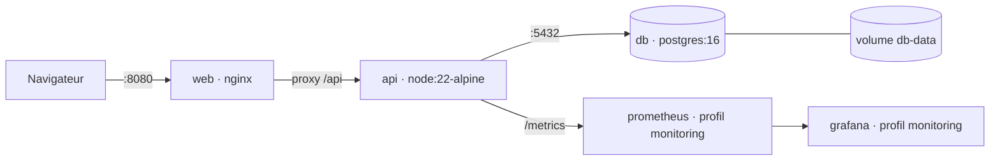
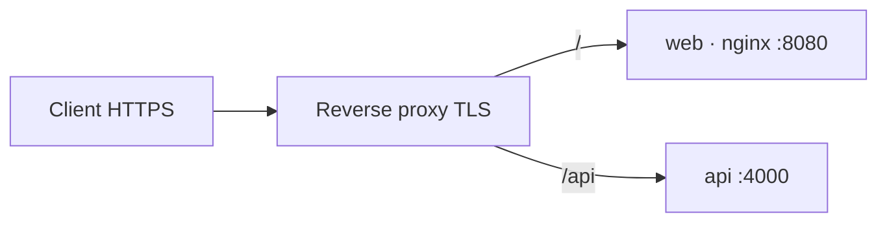
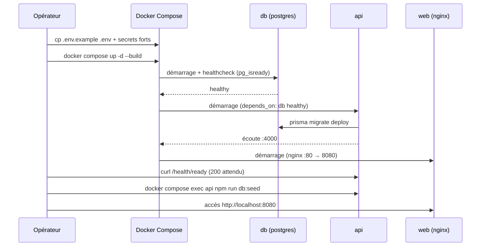
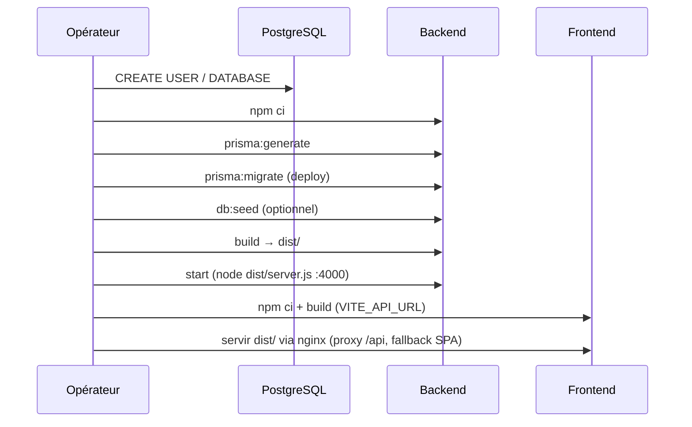

# Manuel de déploiement — SmartBooking

> **Référentiel** : RNCP 39583 « Expert en développement logiciel » — BLOC 2 « Concevoir et développer des applications logicielles ».
> **Compétence couverte** : **C2.4.1** — Déployer l'application dans un environnement de production, de manière reproductible et sécurisée.
> **Dépôt** : `github.com/Sorathia13/ynov-fil-rouge` (monorepo `backend/` + `frontend/`).

Ce manuel décrit deux voies de déploiement de la plateforme SmartBooking :

1. **Déploiement conteneurisé** (recommandé) : Docker + Docker Compose, une seule commande.
2. **Déploiement manuel** : Node.js 22 + PostgreSQL 16 installés directement sur l'hôte.

Il couvre également la configuration de production, l'activation de la supervision, la sauvegarde/restauration de la base et une checklist de mise en production.

---

## 1. Prérequis

### 1.1 Voie conteneurisée (recommandée)

| Composant | Version minimale | Vérification |
|---|---|---|
| Docker Engine | 24+ | `docker --version` |
| Docker Compose (plugin v2) | 2.20+ | `docker compose version` |
| Accès réseau sortant | — | Récupération des images `node:22-alpine`, `postgres:16-alpine`, `nginx:alpine`, `prom/prometheus`, `grafana/grafana` |

Ressources conseillées pour l'hôte : 2 vCPU, 2 Gio de RAM, 10 Gio de disque (dont le volume `db-data`).

### 1.2 Voie manuelle

| Composant | Version | Vérification |
|---|---|---|
| Node.js | 22 LTS (`engines: >=20`) | `node --version` |
| npm | fourni avec Node 22 | `npm --version` |
| PostgreSQL | 16 | `psql --version` |
| Git | 2.30+ | `git --version` |

> **Note** : le projet est développé et testé sous Node 22. La contrainte `engines` autorise Node ≥ 20, mais la cible de production reste **Node 22**.

### 1.3 Récupération du code

```bash
git clone https://github.com/Sorathia13/ynov-fil-rouge.git
cd ynov-fil-rouge
```

---

## 2. Variables d'environnement

La configuration du backend est **validée au démarrage par Zod** (`backend/src/infrastructure/config/env.ts`). Une variable manquante ou invalide provoque un arrêt immédiat (*fail-fast*) avec un message explicite, plutôt qu'un bug obscur en production.

### 2.1 Backend (API)

Fichier de référence : `backend/.env.example`.

| Variable | Description | Valeur d'exemple | Défaut |
|---|---|---|---|
| `NODE_ENV` | Mode d'exécution (`development`, `test`, `production`) | `production` | `development` |
| `PORT` | Port d'écoute de l'API | `4000` | `4000` |
| `DATABASE_URL` | Chaîne de connexion PostgreSQL (Prisma) | `postgresql://smartbooking:motdepasse@db:5432/smartbooking?schema=public` | connexion locale |
| `JWT_ACCESS_SECRET` | Secret de signature du token d'accès (**fort en prod**) | `openssl rand -hex 32` | `dev-access-secret-change-me` |
| `JWT_REFRESH_SECRET` | Secret de signature du refresh token (**fort en prod**) | `openssl rand -hex 32` | `dev-refresh-secret-change-me` |
| `JWT_ACCESS_TTL` | Durée de vie du token d'accès (secondes) | `900` (15 min) | `900` |
| `JWT_REFRESH_TTL` | Durée de vie du refresh token (secondes) | `604800` (7 jours) | `604800` |
| `CORS_ORIGIN` | Origine(s) autorisée(s) (liste blanche) | `https://app.smartbooking.example` | `http://localhost:5173` |
| `RATE_LIMIT_WINDOW_MS` | Fenêtre du rate limiting global (ms) | `900000` (15 min) | `900000` |
| `RATE_LIMIT_MAX` | Requêtes max par fenêtre (global) | `300` | `300` |
| `AUTH_RATE_LIMIT_MAX` | Requêtes max par fenêtre sur `/auth/*` (strict) | `10` | `10` |
| `BCRYPT_ROUNDS` | Coût bcrypt du hachage des mots de passe (10–15) | `12` | `12` |
| `LOG_LEVEL` | Niveau de log Winston (`error`…`debug`) | `info` | `info` |
| `MIN_LEAD_MINUTES` | Délai de prévenance minimal imposé par le moteur de planification (minutes) | `60` | `60` |

> **Garde de production** : si `NODE_ENV=production` et que `JWT_ACCESS_SECRET` ou `JWT_REFRESH_SECRET` contient encore la chaîne `change-me`, l'API **refuse de démarrer**. Ce garde-fou est implémenté dans `env.ts`.

### 2.2 Frontend (build)

Fichier de référence : `frontend/.env.example`. La valeur est injectée **au moment du build** (Vite), pas à l'exécution.

| Variable | Description | Valeur d'exemple | Défaut |
|---|---|---|---|
| `VITE_API_URL` | URL de base de l'API consommée par le client | `/api` (via proxy nginx) ou `https://api.smartbooking.example/api` | `/api` |

En développement local, laisser `VITE_API_URL` non défini : le proxy Vite redirige `/api` vers `http://localhost:4000`.

### 2.3 Orchestration Docker Compose

Fichier de référence : `.env.example` à la racine. Ces variables alimentent `docker-compose.yml` (substitution `${VAR:-défaut}`).

| Variable | Rôle | Valeur d'exemple |
|---|---|---|
| `JWT_ACCESS_SECRET` | Injectée dans le service `api` | `openssl rand -hex 32` |
| `JWT_REFRESH_SECRET` | Injectée dans le service `api` | `openssl rand -hex 32` |
| `CORS_ORIGIN` | Origine front autorisée par l'API | `http://localhost:8080` |
| `VITE_API_URL` | `ARG` de build de l'image `web` | `/api` |

---

## 3. Déploiement conteneurisé (pas-à-pas)

### 3.1 Architecture des conteneurs



Services définis dans `docker-compose.yml` :

| Service | Image / build | Port hôte | Rôle |
|---|---|---|---|
| `db` | `postgres:16-alpine` | `5432` | Base de données, volume `db-data`, `healthcheck pg_isready` |
| `api` | build `./backend/Dockerfile` | `4000` | API Express, `migrate deploy` au démarrage |
| `web` | build `./frontend/Dockerfile` | `8080 → 80` | Front React servi par nginx (proxy `/api`) |
| `prometheus` | `prom/prometheus:latest` | `9090` | Métriques — **profil `monitoring`** |
| `grafana` | `grafana/grafana:latest` | `3001 → 3000` | Tableaux de bord — **profil `monitoring`** |

### 3.2 Étape 1 — Préparer les secrets

```bash
cp .env.example .env
# Générer des secrets forts et les reporter dans .env
openssl rand -hex 32   # → JWT_ACCESS_SECRET
openssl rand -hex 32   # → JWT_REFRESH_SECRET
```

Éditer `.env` (au minimum `JWT_ACCESS_SECRET`, `JWT_REFRESH_SECRET`, `CORS_ORIGIN`, `VITE_API_URL`).

### 3.3 Étape 2 — Construire et lancer

```bash
docker compose up -d --build
```

Cette commande démarre `db`, `api` et `web`. L'image API applique automatiquement les migrations Prisma au démarrage (`npx prisma migrate deploy && node dist/server.js`, cf. `backend/Dockerfile`).

### 3.4 Étape 3 — Vérifier la santé

```bash
# État des conteneurs
docker compose ps

# Liveness (l'API répond)
curl -f http://localhost:4000/health

# Readiness (l'API + ping DB)
curl -f http://localhost:4000/health/ready

# Front servi par nginx
curl -I http://localhost:8080
```

Réponse attendue de `/health/ready` : code HTTP 200 lorsque la base répond. Le `healthcheck` Docker du service `db` (`pg_isready`) garantit que l'API n'est démarrée qu'une fois PostgreSQL prêt (`depends_on: condition: service_healthy`).

### 3.5 Étape 4 — Amorcer les données (seed idempotent)

Le seed est **idempotent** : il peut être rejoué sans dupliquer les données. Il crée les comptes de démonstration.

```bash
docker compose exec api npm run db:seed
```

| Compte | Rôle | Mot de passe |
|---|---|---|
| `admin@smartbooking.dev` | ADMIN | `Password123!` |
| `pro@smartbooking.dev` | PRO | `Password123!` |
| `client@smartbooking.dev` | CLIENT | `Password123!` |

> En production réelle, **ne pas** conserver les comptes de démonstration : ils sont destinés à l'évaluation et aux tests.

### 3.6 Points d'accès

| Ressource | URL |
|---|---|
| Application web | `http://localhost:8080` |
| API | `http://localhost:4000/api` |
| Documentation OpenAPI (Swagger UI) | `http://localhost:4000/api/docs` |
| Spec OpenAPI (JSON) | `http://localhost:4000/api/docs.json` |
| Liveness | `http://localhost:4000/health` |
| Readiness | `http://localhost:4000/health/ready` |
| Métriques Prometheus | `http://localhost:4000/metrics` |

### 3.7 Logs et arrêt

```bash
docker compose logs -f api      # suivre les logs de l'API
docker compose logs -f          # tous les services
docker compose down             # arrêt (volumes conservés)
docker compose down -v          # arrêt + suppression des volumes (DESTRUCTIF)
```

---

## 4. Déploiement manuel (sans Docker)

À utiliser lorsque Node 22 et PostgreSQL 16 sont installés directement sur l'hôte.

### 4.1 Préparer la base

```sql
-- psql en tant que superutilisateur
CREATE USER smartbooking WITH PASSWORD 'un-mot-de-passe-fort';
CREATE DATABASE smartbooking OWNER smartbooking;
```

### 4.2 Backend

```bash
cd backend
cp .env.example .env
# Renseigner DATABASE_URL, JWT_ACCESS_SECRET, JWT_REFRESH_SECRET, CORS_ORIGIN, NODE_ENV=production…

npm ci                       # installation reproductible (lockfile)
npm run prisma:generate      # génère le client Prisma
npm run prisma:migrate       # = prisma migrate deploy (applique les migrations)
npm run db:seed              # optionnel : comptes de démonstration
npm run build                # compile TypeScript → dist/
npm run start                # = node dist/server.js (port 4000)
```

Séquence des scripts (`backend/package.json`) :

| Script | Commande sous-jacente | Rôle |
|---|---|---|
| `prisma:generate` | `prisma generate` | Génère le client Prisma typé |
| `prisma:migrate` | `prisma migrate deploy` | Applique les migrations en production |
| `db:seed` | `tsx prisma/seed.ts` | Amorçage idempotent |
| `build` | `tsc -p tsconfig.json` | Transpile vers `dist/` |
| `start` | `node dist/server.js` | Démarre l'API compilée |

> **Ordre impératif** : `prisma:migrate` **avant** `start`. En production, ne jamais utiliser `prisma migrate dev` (réservé au développement) ; utiliser `prisma migrate deploy`.

### 4.3 Frontend

```bash
cd frontend
npm ci
# Définir VITE_API_URL vers l'API publique, ex. https://api.smartbooking.example/api
VITE_API_URL=https://api.smartbooking.example/api npm run build
```

Le build produit `frontend/dist/` (fichiers statiques). Les servir via un serveur web (nginx, Caddy…) en configurant :

- le **fallback SPA** (toutes les routes inconnues → `index.html`) ;
- le **proxy `/api`** vers l'API si l'on souhaite un chemin relatif (`VITE_API_URL=/api`) ;
- les **en-têtes de sécurité** (cf. la configuration `frontend/nginx.conf` utilisée par l'image Docker).

### 4.4 Exécution en service

Pour un service persistant, exécuter `node dist/server.js` sous un gestionnaire de processus (systemd, pm2…) avec redémarrage automatique et journalisation. Exemple d'unité systemd minimale :

```ini
[Unit]
Description=SmartBooking API
After=network.target postgresql.service

[Service]
WorkingDirectory=/opt/smartbooking/backend
EnvironmentFile=/opt/smartbooking/backend/.env
ExecStart=/usr/bin/node dist/server.js
Restart=on-failure
User=smartbooking

[Install]
WantedBy=multi-user.target
```

---

## 5. Configuration de production

### 5.1 Secrets forts

- Générer `JWT_ACCESS_SECRET` et `JWT_REFRESH_SECRET` avec `openssl rand -hex 32` (32 octets aléatoires).
- **Ne jamais** conserver de valeur contenant `change-me` : l'API refuse de démarrer en `production` dans ce cas.
- Stocker les secrets hors du dépôt (gestionnaire de secrets, variables d'environnement de l'orchestrateur). Le `.env` n'est pas versionné (`.gitignore`).
- Changer le mot de passe PostgreSQL par défaut (`smartbooking`) et celui de Grafana (`GF_SECURITY_ADMIN_PASSWORD`).

### 5.2 CORS

Renseigner `CORS_ORIGIN` avec l'origine **exacte** du front en production (schéma + hôte + port), par exemple :

```bash
CORS_ORIGIN=https://app.smartbooking.example
```

La liste blanche est appliquée côté API ; aucune origine « joker » n'est utilisée. Les cookies (refresh token) étant `httpOnly/secure/sameSite`, l'origine doit être servie en HTTPS.

### 5.3 Reverse proxy HTTPS

Placer un reverse proxy (nginx, Caddy, Traefik) en frontal, terminant TLS et relayant vers `web` (statique) et `api`.



Points d'attention :

- Terminer TLS au niveau du proxy (certificat Let's Encrypt ou équivalent).
- Transmettre `X-Forwarded-*` pour la corrélation et les logs.
- Les cookies `secure` exigent HTTPS de bout en bout côté client.
- Conserver les en-têtes de sécurité (Helmet est déjà actif côté API ; `x-powered-by` est désactivé).

Exemple de bloc nginx frontal :

```nginx
server {
  listen 443 ssl;
  server_name app.smartbooking.example;

  ssl_certificate     /etc/letsencrypt/live/app.smartbooking.example/fullchain.pem;
  ssl_certificate_key /etc/letsencrypt/live/app.smartbooking.example/privkey.pem;

  location /api/ {
    proxy_pass http://127.0.0.1:4000/api/;
    proxy_set_header Host $host;
    proxy_set_header X-Forwarded-For $proxy_add_x_forwarded_for;
    proxy_set_header X-Forwarded-Proto $scheme;
  }

  location / {
    proxy_pass http://127.0.0.1:8080/;
  }
}
```

### 5.4 Délai de prévenance (`MIN_LEAD_MINUTES`)

`MIN_LEAD_MINUTES` définit le délai minimal, en minutes, entre l'instant présent et le début d'un créneau réservable. Le moteur de planification l'applique dans `buildFreeIntervals` et le renvoie via la raison `LEAD_TIME` lorsqu'un créneau est trop proche.

```bash
MIN_LEAD_MINUTES=60   # aucun rendez-vous à moins d'une heure
```

Adapter selon le métier : `0` désactive la contrainte, une valeur élevée impose une réservation anticipée.

### 5.5 Autres réglages de production

| Variable | Valeur de production conseillée |
|---|---|
| `NODE_ENV` | `production` (active les logs JSON structurés Winston) |
| `LOG_LEVEL` | `info` (ou `warn` pour réduire le volume) |
| `BCRYPT_ROUNDS` | `12` (compromis coût/sécurité) |
| `RATE_LIMIT_MAX` / `AUTH_RATE_LIMIT_MAX` | ajuster selon le trafic réel |

---

## 6. Activation de la supervision (profil `monitoring`)

Prometheus et Grafana sont déclarés sous le **profil `monitoring`** : ils ne démarrent que si ce profil est explicitement activé.

```bash
docker compose --profile monitoring up -d
```

| Service | URL | Identifiants |
|---|---|---|
| Prometheus | `http://localhost:9090` | — |
| Grafana | `http://localhost:3001` | `admin` / `admin` (à changer en prod via `GF_SECURITY_ADMIN_PASSWORD`) |

Fonctionnement :

- L'API expose `GET /metrics` (via `prom-client`) : `http_request_duration_seconds`, `http_requests_total`, ainsi que les métriques process par défaut.
- Prometheus scrute cet endpoint (configuration `monitoring/prometheus.yml`).
- Grafana est pré-provisionné avec la source de données Prometheus (`monitoring/grafana-datasource.yml`).

Vérification rapide :

```bash
curl -s http://localhost:4000/metrics | head       # métriques exposées
curl -s http://localhost:9090/-/ready              # Prometheus prêt
```

Pour arrêter uniquement la supervision :

```bash
docker compose --profile monitoring stop prometheus grafana
```

---

## 7. Sauvegarde et restauration de la base

Les données persistent dans le volume Docker `db-data`. Deux approches complémentaires : dump logique (`pg_dump`) et sauvegarde du volume.

### 7.1 Sauvegarde logique (recommandée)

```bash
# Dump compressé horodaté depuis le conteneur db
docker compose exec -T db pg_dump -U smartbooking -d smartbooking -Fc \
  > "backup-smartbooking-$(date +%Y%m%d-%H%M%S).dump"
```

En déploiement manuel :

```bash
pg_dump -U smartbooking -d smartbooking -Fc > backup-smartbooking.dump
```

### 7.2 Restauration

```bash
# Restauration dans une base existante (nettoyage préalable des objets)
cat backup-smartbooking.dump | \
  docker compose exec -T db pg_restore -U smartbooking -d smartbooking --clean --if-exists
```

En déploiement manuel :

```bash
pg_restore -U smartbooking -d smartbooking --clean --if-exists backup-smartbooking.dump
```

> Après restauration, exécuter `npm run prisma:migrate` (ou laisser l'API l'appliquer au démarrage) pour garantir que le schéma est à jour vis-à-vis des migrations.

### 7.3 Sauvegarde du volume (image disque)

```bash
docker run --rm -v ynov-fil-rouge_db-data:/data -v "$PWD:/backup" alpine \
  tar czf /backup/db-data-$(date +%Y%m%d).tar.gz -C /data .
```

### 7.4 Bonnes pratiques

- Automatiser un `pg_dump` quotidien et le déposer hors de l'hôte (stockage objet chiffré).
- Tester régulièrement la **restauration** (une sauvegarde non testée n'est pas une sauvegarde).
- Conserver une rétention glissante (ex. 7 quotidiennes + 4 hebdomadaires).

---

## 8. Checklist de mise en production

Cocher chaque point avant d'exposer l'application.

**Secrets et configuration**
- [ ] `JWT_ACCESS_SECRET` et `JWT_REFRESH_SECRET` générés aléatoirement (32 octets), sans `change-me`.
- [ ] Mot de passe PostgreSQL modifié (≠ `smartbooking`), `DATABASE_URL` à jour.
- [ ] `NODE_ENV=production`.
- [ ] `CORS_ORIGIN` = origine HTTPS exacte du front.
- [ ] `VITE_API_URL` correct au moment du **build** du front.
- [ ] `MIN_LEAD_MINUTES` réglé selon le métier.
- [ ] Mot de passe Grafana (`GF_SECURITY_ADMIN_PASSWORD`) modifié si supervision active.

**Réseau et sécurité**
- [ ] Reverse proxy HTTPS en place (TLS valide, redirection HTTP → HTTPS).
- [ ] Cookies `secure` fonctionnels (bout en bout HTTPS).
- [ ] Ports internes (`5432`, `4000`) non exposés publiquement — seul le proxy est accessible.
- [ ] Rate limiting (`RATE_LIMIT_*`, `AUTH_RATE_LIMIT_MAX`) validé.

**Base de données**
- [ ] Migrations appliquées (`prisma migrate deploy`).
- [ ] Comptes de démonstration supprimés ou désactivés (si production réelle).
- [ ] Sauvegarde initiale réalisée et restauration testée.
- [ ] Tâche de sauvegarde planifiée.

**Qualité et observabilité**
- [ ] CI verte sur le commit déployé (lint, typecheck, tests, build — 69 tests verts).
- [ ] `GET /health` et `GET /health/ready` répondent 200.
- [ ] `GET /metrics` expose les métriques ; scrape Prometheus opérationnel si supervision active.
- [ ] Logs Winston (JSON, `requestId`) visibles et corrélables.
- [ ] Swagger UI accessible sur `/api/docs`.

---

## 9. Séquences de déploiement

### 9.1 Séquence conteneurisée (première mise en production)



### 9.2 Séquence manuelle



### 9.3 Mise à jour (déploiement d'une nouvelle version)

```bash
git pull
docker compose up -d --build          # reconstruit les images modifiées
# Les migrations Prisma en attente sont appliquées automatiquement au démarrage de l'API
docker compose exec api curl -f http://localhost:4000/health/ready
```

Pipeline **GitHub Actions** de référence (exécuté avant tout déploiement) : jobs `backend` (avec service Postgres), `frontend` et `docker`, enchaînant `npm ci` → `prisma generate` → `lint` → `typecheck` → `prisma migrate deploy` → `test:coverage` → `build` → build des images Docker, avec `concurrency: cancel-in-progress`.

### 9.4 Rollback

```bash
# Revenir à la version précédente du code
git checkout <tag-ou-commit-precedent>
docker compose up -d --build

# Si une migration doit être annulée : restaurer la sauvegarde antérieure (§7.2)
```

> Prisma `migrate deploy` n'annule pas automatiquement une migration. Un rollback de schéma passe par la **restauration d'une sauvegarde** prise avant la mise à jour, ou par une migration corrective explicite. Toujours sauvegarder la base **avant** un déploiement porteur de migrations.

---

## 10. Dépannage rapide

| Symptôme | Cause probable | Résolution |
|---|---|---|
| L'API refuse de démarrer en prod | Secrets `change-me` ou env invalide | Définir des secrets forts ; lire le message Zod au démarrage |
| `/health/ready` renvoie une erreur | Base indisponible | Vérifier `db` (`docker compose ps`, `pg_isready`), `DATABASE_URL` |
| Erreurs CORS côté navigateur | `CORS_ORIGIN` incorrect | Aligner exactement schéma + hôte + port du front |
| Cookies de session non conservés | Absence de HTTPS | Servir en HTTPS (cookies `secure`) via le reverse proxy |
| Front appelle la mauvaise API | `VITE_API_URL` figé au build | Reconstruire l'image `web` avec la bonne valeur |
| Migrations non appliquées (manuel) | `start` lancé avant `migrate` | Exécuter `npm run prisma:migrate` puis `npm run start` |
