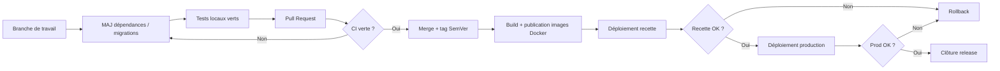
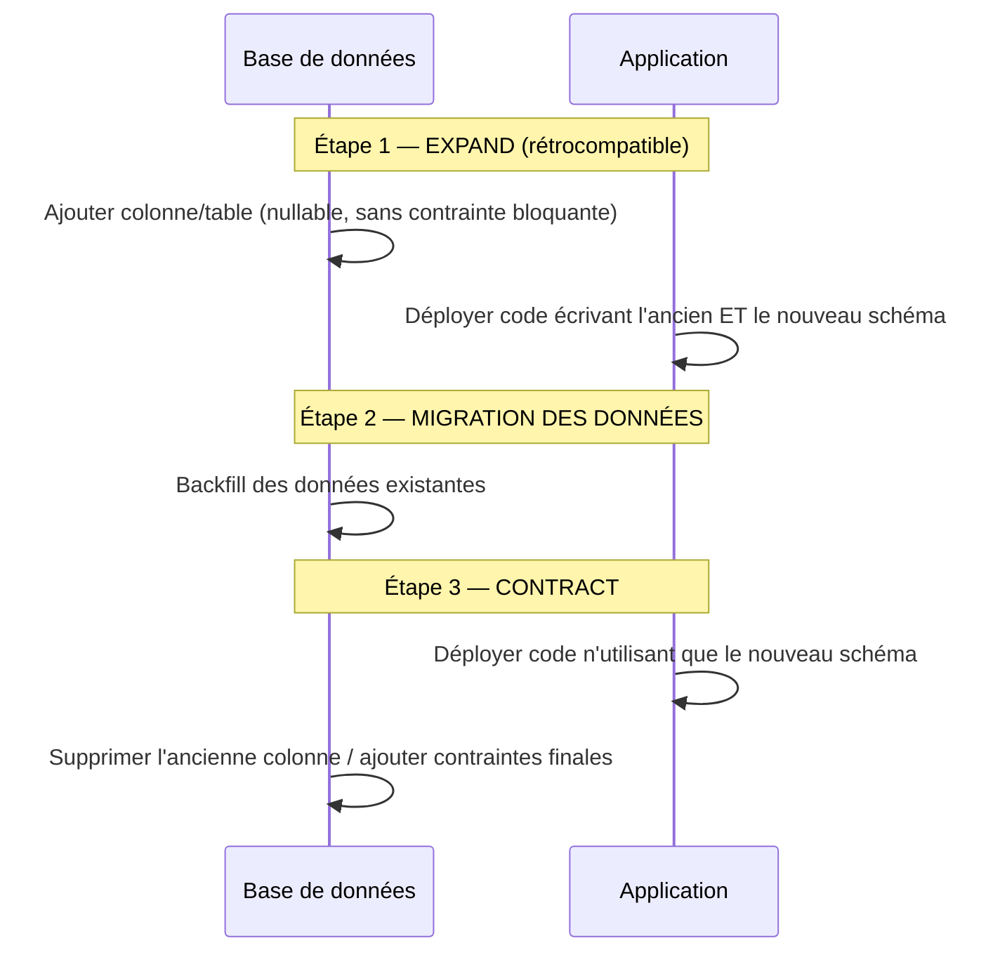
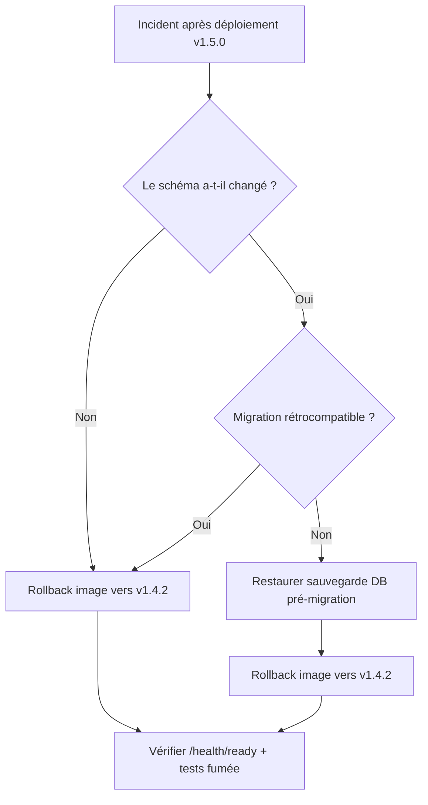
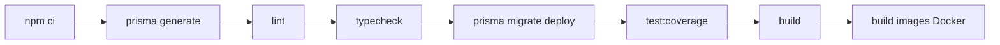

# Manuel de mise à jour — SmartBooking

> **Référentiel** : Certification RNCP 39583 « Expert en développement logiciel »
> **Bloc** : BLOC 2 — Concevoir et développer des applications logicielles
> **Compétence** : C2.4.1 — Élaborer et documenter le manuel de mise à jour du logiciel
> **Dépôt** : `github.com/Sorathia13/ynov-fil-rouge` (monorepo `backend/` + `frontend/`)

Ce manuel décrit les procédures opérationnelles pour maintenir SmartBooking à jour en toute sécurité : mise à jour des dépendances, application des migrations de schéma, publication d'une nouvelle version (release), retour arrière (rollback) et tests de non-régression obligatoires avant tout déploiement.

---

## Table des matières

1. [Périmètre et prérequis](#1-périmètre-et-prérequis)
2. [Principes généraux](#2-principes-généraux)
3. [Mise à jour des dépendances](#3-mise-à-jour-des-dépendances)
4. [Application des migrations de schéma](#4-application-des-migrations-de-schéma)
5. [Procédure de release](#5-procédure-de-release)
6. [Procédure de rollback](#6-procédure-de-rollback)
7. [Tests de non-régression obligatoires](#7-tests-de-non-régression-obligatoires)
8. [Aide-mémoire (checklists)](#8-aide-mémoire-checklists)

---

## 1. Périmètre et prérequis

### 1.1 Composants concernés

| Composant | Technologie | Emplacement |
|-----------|-------------|-------------|
| Backend (API) | Node.js 22, Express 4, TypeScript strict, Prisma 5 | `backend/` |
| Frontend (Web) | React 18, TypeScript, Vite 5, Tailwind CSS 3 | `frontend/` |
| Base de données | PostgreSQL 16 | service `db` (docker-compose) |
| Conteneurs | Dockerfile multi-stage API + frontend/nginx | racine, `docker-compose.yml` |
| Observabilité | Prometheus + Grafana (profil `monitoring`) | `monitoring/` |

### 1.2 Outils requis sur le poste de maintenance

- Node.js 22 (LTS) et npm (le projet utilise `npm ci` et des lockfiles).
- Docker et Docker Compose.
- Git avec accès en écriture au dépôt et aux tags.
- Accès à la base PostgreSQL de l'environnement ciblé (variables d'environnement validées par Zod au démarrage).

### 1.3 Variables d'environnement

La configuration est validée par Zod au démarrage (`infrastructure/config`) avec un principe **fail-fast** : un environnement mal configuré empêche le démarrage. En production, une garde vérifie explicitement la présence des secrets (JWT, base de données…). Vérifier ces variables **avant** toute mise à jour ou migration.

---

## 2. Principes généraux

- **Rien en direct sur la production sans CI verte.** Toute mise à jour passe d'abord par la CI GitHub Actions (jobs `backend`, `frontend`, `docker`) puis par un environnement de recette.
- **Reproductibilité.** On installe toujours avec `npm ci` (respect strict du `package-lock.json`), jamais `npm install` sur les environnements automatisés.
- **Immutabilité des images.** Une image Docker publiée n'est jamais réécrite : chaque release produit une image taguée par sa version SemVer.
- **Réversibilité.** Toute évolution de schéma doit être pensée avec sa migration inverse, et toute release doit pouvoir être ramenée à l'image précédente.
- **Traçabilité.** Chaque changement est associé à une entrée de CHANGELOG, un tag Git et des logs d'exécution (Winston, `requestId` de corrélation).

Cycle de vie d'une mise à jour :



---

## 3. Mise à jour des dépendances

Les dépendances sont **épinglées** et gérées via lockfiles. La mise à jour se fait de manière contrôlée, package manager par package manager, dans chaque paquet du monorepo (`backend/`, `frontend/`).

### 3.1 Auditer l'existant

Avant toute modification, dresser l'état des lieux :

```bash
# Dans backend/ puis dans frontend/
npm outdated          # liste les paquets en retard (current / wanted / latest)
npm audit             # vulnérabilités connues
```

Lecture de `npm outdated` :

| Colonne | Signification |
|---------|---------------|
| `Current` | version actuellement installée |
| `Wanted` | version max compatible avec la plage du `package.json` |
| `Latest` | dernière version publiée sur le registre |

### 3.2 Mises à jour mineures et correctifs (patch/minor)

Sans risque de rupture d'API : on reste dans la plage SemVer autorisée.

```bash
# Dans backend/ puis frontend/
npm update            # met à jour selon les plages du package.json
npm ci                # réinstallation propre depuis le lockfile mis à jour
```

### 3.3 Mises à jour majeures (major)

Une version majeure peut introduire des ruptures. Procéder **un paquet à la fois** :

```bash
# Exemple : montée de version majeure d'un paquet
npm install <paquet>@latest      # met à jour package.json + lockfile
```

Après chaque montée majeure :

1. `npm run typecheck` (TypeScript strict : `noUnusedLocals`, `strictNullChecks`…).
2. `npm run lint` (ESLint + Prettier).
3. La suite de tests complète (voir [section 7](#7-tests-de-non-régression-obligatoires)).
4. Lire le CHANGELOG amont du paquet et adapter le code aux ruptures éventuelles.

> **Bonne pratique** : une PR = une préoccupation. Ne pas mélanger une montée majeure risquée (ex. Express, Prisma, React) avec d'autres changements fonctionnels.

### 3.4 Cas particulier : mise à jour de Prisma

Prisma est composé de deux paquets qui **doivent rester à la même version** : le CLI (`prisma`, en `devDependencies`) et le client (`@prisma/client`, en `dependencies`).

```bash
# Dans backend/
npm install prisma@latest @prisma/client@latest

# Régénérer impérativement le client après toute MAJ de Prisma
npm run prisma:generate          # équiv. prisma generate
```

La régénération du client (`prisma generate`) est **obligatoire** dès que :

- la version de Prisma change ;
- le fichier `schema.prisma` est modifié.

À défaut, le client TypeScript généré est désynchronisé du schéma et le `typecheck` ou l'exécution échoueront.

Vérifications post-MAJ Prisma :

```bash
npm run prisma:generate
npm run typecheck
npm run test:unit          # 47 tests unitaires du domaine
npm run test:integration   # 16 tests d'intégration (DB)
```

### 3.5 Vérifier la vulnérabilité et corriger

```bash
npm audit                  # rapport de vulnérabilités
npm audit fix              # correctifs non cassants
# npm audit fix --force   # à n'utiliser qu'en dernier recours, revalider toute la suite de tests
```

### 3.6 Valider et committer

Le lockfile mis à jour **doit** être committé pour garantir la reproductibilité (`npm ci` en CI et en build Docker).

```bash
git add package.json package-lock.json
git commit -m "chore(deps): mise à jour des dépendances <périmètre>"
```

---

## 4. Application des migrations de schéma

Le schéma PostgreSQL est piloté par Prisma Migrate. Le modèle couvre : `User`, `RefreshToken`, `Professional`, `Service`, `WorkingHours`, `TimeOff`, `Appointment`, `AuditLog`.

**Règle d'or** : on **crée** les migrations en développement, on ne fait que les **appliquer** en production.

| Environnement | Commande | Rôle |
|---------------|----------|------|
| Développement | `npm run prisma:migrate:dev` (`prisma migrate dev`) | crée le fichier de migration, applique et régénère le client |
| Production / CI | `npm run prisma:migrate` (`prisma migrate deploy`) | applique uniquement les migrations existantes, sans en générer |

### 4.1 Créer une migration en développement

1. Modifier `schema.prisma` (nouveau champ, nouvelle table, index…).
2. Générer et appliquer la migration en local :

```bash
# Dans backend/
npm run prisma:migrate:dev
# Prisma demande un nom de migration, ex. "add_appointment_index"
```

Cette commande :

- crée un dossier `prisma/migrations/<timestamp>_<nom>/migration.sql` ;
- applique la migration sur la base de développement ;
- régénère automatiquement le client Prisma.

3. Relire le SQL généré (`migration.sql`) et vérifier qu'il est correct et **réversible** (voir [rollback](#6-procédure-de-rollback)).
4. Committer le dossier de migration **avec** le changement de `schema.prisma`.

```bash
git add prisma/schema.prisma prisma/migrations/
git commit -m "feat(db): <description de la migration>"
```

### 4.2 Appliquer les migrations en production

En production, le déploiement applique uniquement les migrations déjà versionnées :

```bash
npm run prisma:migrate     # prisma migrate deploy
```

`prisma migrate deploy` :

- n'invente aucune migration et ne modifie pas le schéma de manière interactive ;
- applique en ordre les migrations non encore exécutées ;
- est **idempotent** : une migration déjà appliquée est ignorée.

> **Note conteneur** : le Dockerfile multi-stage de l'API exécute `migrate deploy` **au démarrage** du conteneur. Le déploiement d'une nouvelle image applique donc automatiquement les migrations en attente. Ordonner les déploiements pour que la base soit accessible au démarrage de l'API.

### 4.3 Compatibilité et migrations sûres (expand / contract)

Pour éviter toute interruption de service lors d'un déploiement progressif, préférer le patron **expand / contract** :



- **Additif d'abord** : ajouter les colonnes/tables avant de les rendre obligatoires.
- **Éviter les suppressions destructives** dans la même release que le code qui en dépend.
- **Sauvegarde préalable** : réaliser un dump PostgreSQL avant toute migration en production.

```bash
# Sauvegarde avant migration (exemple)
pg_dump -U <user> -d smartbooking -F c -f backup_pre_migration_$(date +%Y%m%d_%H%M%S).dump
```

### 4.4 Seed

Le seed est **idempotent** et crée les comptes de démonstration (`admin@`, `pro@`, `client@smartbooking.dev`, mot de passe `Password123!`).

```bash
npm run db:seed
```

À réserver aux environnements de développement / recette ; ne pas exécuter en production.

---

## 5. Procédure de release

Une release SmartBooking suit le versionnage sémantique, met à jour le CHANGELOG, pose un tag Git, puis construit et publie les images Docker.

### 5.1 Versionnage SemVer

Format : `MAJOR.MINOR.PATCH` (ex. `1.4.2`).

| Incrément | Quand | Exemple |
|-----------|-------|---------|
| **MAJOR** | rupture de compatibilité (API publique, contrat d'endpoint, format d'erreur) | `1.4.2 → 2.0.0` |
| **MINOR** | nouvelle fonctionnalité rétrocompatible (ex. nouvel endpoint, option du moteur de planification) | `1.4.2 → 1.5.0` |
| **PATCH** | correctif rétrocompatible (bug, sécurité, dépendance) | `1.4.2 → 1.4.3` |

Le numéro de version est porté par le `package.json` de chaque paquet ; ils sont alignés sur la version de release.

### 5.2 Mise à jour du CHANGELOG

Tenir un `CHANGELOG.md` au format *Keep a Changelog*. Déplacer les entrées de la section `Unreleased` vers une nouvelle section datée.

```markdown
## [1.5.0] - 2026-07-24

### Ajouté
- Endpoint POST /api/appointments/availability : vérification de disponibilité en amont.

### Modifié
- Moteur de planification : suggestion d'alternatives triées par distance à l'heure désirée.

### Corrigé
- Correction du calcul DST lors de l'expansion des horaires (Europe/Paris).

### Sécurité
- Rotation renforcée des refresh tokens.
```

### 5.3 Étapes de release

```bash
# 1. Se placer sur une branche à jour et propre
git checkout main
git pull --ff-only

# 2. Mettre à jour la version (backend/ et frontend/)
#    --no-git-tag-version pour poser un seul tag global ensuite
npm version 1.5.0 --no-git-tag-version   # dans backend/ puis frontend/

# 3. Mettre à jour le CHANGELOG.md (section datée)

# 4. Committer la release
git add backend/package.json frontend/package.json CHANGELOG.md
git commit -m "chore(release): v1.5.0"

# 5. Poser le tag Git annoté
git tag -a v1.5.0 -m "SmartBooking v1.5.0"

# 6. Pousser commit et tag
git push origin main
git push origin v1.5.0
```

### 5.4 Build et publication des images Docker

Le projet fournit un Dockerfile multi-stage pour l'API (`node:22-alpine`, utilisateur non-root `node`, `dumb-init`, healthcheck, `migrate deploy` au démarrage) et une image frontend (`build` → `nginx` avec proxy `/api`, fallback SPA et en-têtes de sécurité).

Chaque image est taguée **par sa version** et par `latest`.

```bash
# Registre et version
REGISTRY=ghcr.io/sorathia13
VERSION=1.5.0

# --- API ---
docker build -t $REGISTRY/smartbooking-api:$VERSION -t $REGISTRY/smartbooking-api:latest ./backend
docker push $REGISTRY/smartbooking-api:$VERSION
docker push $REGISTRY/smartbooking-api:latest

# --- Frontend ---
docker build -t $REGISTRY/smartbooking-web:$VERSION -t $REGISTRY/smartbooking-web:latest ./frontend
docker push $REGISTRY/smartbooking-web:$VERSION
docker push $REGISTRY/smartbooking-web:latest
```

> La CI GitHub Actions (job `docker`) construit les images dans le cadre du pipeline. La publication manuelle ci-dessus reste la référence documentée ; en pipeline, le tag Git `v*` déclenche le build et le push automatiques.

### 5.5 Déploiement

Le déploiement met à jour les images référencées par `docker-compose.yml` (services `db`, `api`, `web`, plus `prometheus`/`grafana` sous le profil `monitoring`).

```bash
# Sur l'environnement cible : épingler la version puis déployer
export SMARTBOOKING_VERSION=1.5.0
docker compose pull
docker compose up -d --build
```

Au démarrage, le conteneur API applique automatiquement les migrations en attente (`migrate deploy`).

### 5.6 Vérifications post-déploiement

| Vérification | Endpoint / commande | Attendu |
|--------------|---------------------|---------|
| Liveness | `GET /health` | `200 OK` |
| Readiness (ping DB) | `GET /health/ready` | `200 OK` (base joignable) |
| Métriques | `GET /metrics` | exposition Prometheus |
| Documentation API | `GET /api/docs` | Swagger UI accessible |
| Logs | Winston (JSON en prod) | pas d'erreur au démarrage, `requestId` présents |
| Version | tag image en cours d'exécution | `1.5.0` |

---

## 6. Procédure de rollback

Le rollback rétablit un état antérieur stable. Deux plans distincts et complémentaires : **rollback applicatif** (image précédente) et **rollback de schéma** (migration inverse).

### 6.1 Rollback applicatif (image précédente)

C'est le retour arrière le plus rapide : on redéploie l'image de la version précédente.

```bash
# Redéployer la version stable précédente
export SMARTBOOKING_VERSION=1.4.2   # version précédente connue stable
docker compose pull
docker compose up -d
```

Comme chaque version est une image immuable taguée en SemVer, ce retour est déterministe. À privilégier lorsque **le schéma de base n'a pas changé** entre les deux versions.

### 6.2 Rollback de schéma (migration inverse)

Si la nouvelle version a introduit une migration incompatible avec l'ancienne version applicative, le simple retour d'image ne suffit pas : il faut aussi défaire la migration.



Options, de la plus sûre à la plus lourde :

1. **Migration inverse versionnée (recommandé)** : créer en développement une nouvelle migration qui annule les changements (ex. supprimer la colonne ajoutée), la valider par la CI, puis l'appliquer en production via `migrate deploy`. C'est la voie « avant » (forward-fix) : on ne réécrit pas l'historique, on ajoute une migration corrective.

```bash
# En développement : rédiger la migration inverse
npm run prisma:migrate:dev   # nom ex. "revert_appointment_index"
# Après validation CI, en production :
npm run prisma:migrate       # migrate deploy applique la correction
```

2. **Restauration de sauvegarde** : si la migration est destructive (perte de données), restaurer le dump PostgreSQL réalisé **avant** la migration ([section 4.3](#43-compatibilité-et-migrations-sûres-expand--contract)), puis redéployer l'image précédente.

```bash
# Restauration du dump réalisé avant migration
pg_restore -U <user> -d smartbooking --clean --if-exists backup_pre_migration_<horodatage>.dump
```

> **Important** : `prisma migrate deploy` ne « défait » pas une migration. Le rollback de schéma se fait soit par une migration inverse versionnée (forward-fix), soit par restauration de sauvegarde. C'est pourquoi le patron expand/contract et le dump préalable sont obligatoires en production.

### 6.3 Après le rollback

- Vérifier `GET /health/ready` (readiness + ping DB) et lancer les tests de fumée.
- Consigner l'incident (cause, actions, version cible) et créer une entrée CHANGELOG si une version corrective est publiée.
- Ne pas réutiliser un numéro de version : publier une nouvelle version corrective (ex. `1.5.1`).

---

## 7. Tests de non-régression obligatoires

**Aucun déploiement n'est autorisé sans CI verte.** La suite couvre 69 tests vérifiés.

### 7.1 Périmètre des tests

| Périmètre | Outils | Volume |
|-----------|--------|--------|
| Backend — unitaires (domaine) | Vitest | 47 tests |
| Backend — intégration (HTTP + DB) | Vitest + Supertest | 16 tests |
| Frontend | Vitest + Testing Library | 6 tests |
| **Total** | | **69 tests verts** |

Le cœur métier — le moteur de planification (`SchedulingEngine`, `availability.service`, `Interval`) — est un domaine pur sans I/O avec `now` injecté, donc **déterministe** et intégralement couvert par les tests unitaires (détection de conflit, anti-double-réservation, suggestion d'alternatives, gestion DST Europe/Paris).

### 7.2 Exécution locale avant PR

```bash
# Backend (dans backend/)
npm run lint
npm run typecheck
npm run test:coverage      # unitaires + intégration avec couverture

# Frontend (dans frontend/)
npm run lint
npm run typecheck
npm run test
```

### 7.3 Pipeline CI (GitHub Actions)

La CI est la barrière de non-régression officielle. Elle comporte les jobs `backend` (avec service PostgreSQL), `frontend` et `docker`, avec `concurrency` en `cancel-in-progress`.

Étapes du pipeline :



| Étape | Commande | Rôle |
|-------|----------|------|
| Installation | `npm ci` | installation reproductible depuis lockfile |
| Client Prisma | `prisma generate` | génération du client |
| Lint | `lint` | ESLint + Prettier |
| Typage | `typecheck` | TypeScript strict |
| Migrations | `prisma migrate deploy` | schéma appliqué sur la DB de test |
| Tests | `test:coverage` | suite complète + couverture |
| Build | `build` | compilation backend + build Vite |
| Docker | build images | vérification de la conteneurisation |

### 7.4 Critères de passage (gate de déploiement)

Un déploiement est autorisé si **et seulement si** :

- [ ] la CI est **verte** sur la branche mergée (tous les jobs) ;
- [ ] `lint` et `typecheck` passent (backend + frontend) ;
- [ ] les 69 tests sont verts ;
- [ ] les migrations s'appliquent proprement (`migrate deploy` OK en CI) ;
- [ ] les images Docker se construisent sans erreur ;
- [ ] la recette manuelle des parcours critiques est validée (réservation, détection de conflit, alternatives, authentification).

---

## 8. Aide-mémoire (checklists)

### 8.1 Checklist — Mise à jour des dépendances

- [ ] `npm outdated` + `npm audit` (backend et frontend).
- [ ] MAJ patch/minor : `npm update` puis `npm ci`.
- [ ] MAJ major : un paquet à la fois, relire les CHANGELOG amont.
- [ ] Prisma : `prisma`/`@prisma/client` alignés + `npm run prisma:generate`.
- [ ] `typecheck`, `lint`, suite de tests complète verte.
- [ ] Commit du `package.json` **et** du `package-lock.json`.

### 8.2 Checklist — Migration de schéma

- [ ] Dev : `prisma migrate dev`, relire le `migration.sql`.
- [ ] Migration additive/rétrocompatible (patron expand/contract).
- [ ] Commit `schema.prisma` + dossier `prisma/migrations/`.
- [ ] Sauvegarde `pg_dump` avant application en production.
- [ ] Prod : `prisma migrate deploy` (ou automatique au démarrage du conteneur API).

### 8.3 Checklist — Release

- [ ] Branche `main` à jour et propre, CI verte.
- [ ] `npm version <x.y.z>` (backend + frontend).
- [ ] CHANGELOG mis à jour (section datée).
- [ ] Commit `chore(release): vX.Y.Z` + tag annoté `vX.Y.Z`.
- [ ] `git push` du commit et du tag.
- [ ] Build + push des images Docker (`api`, `web`) taguées `X.Y.Z` et `latest`.
- [ ] Déploiement, puis `/health`, `/health/ready`, `/metrics`, `/api/docs`.

### 8.4 Checklist — Rollback

- [ ] Identifier si le schéma a changé entre les deux versions.
- [ ] Schéma inchangé : redéployer l'image précédente (`SMARTBOOKING_VERSION`).
- [ ] Schéma changé : migration inverse versionnée (forward-fix) **ou** restauration du dump pré-migration.
- [ ] Vérifier `/health/ready` + tests de fumée.
- [ ] Publier une version corrective (ne jamais réutiliser un numéro de version).

---

*Document de maintenance SmartBooking — C2.4.1. À tenir à jour à chaque évolution des procédures d'exploitation.*
