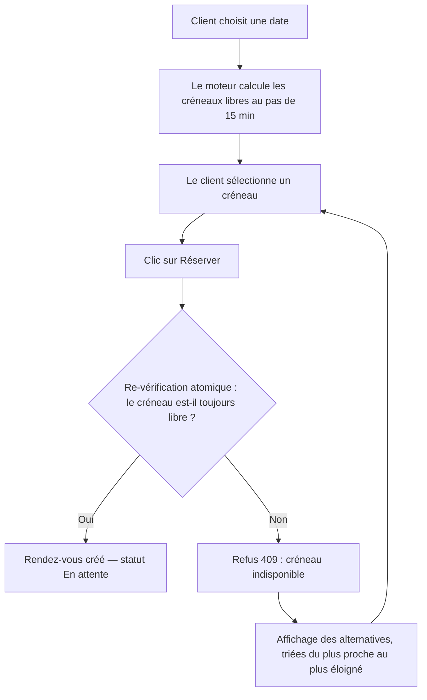

# Manuel d'utilisation — SmartBooking

SmartBooking est une plateforme de prise de rendez-vous en ligne. Elle met en relation des **clients** qui souhaitent réserver une prestation et des **professionnels** qui proposent leurs services. Son cœur est un **moteur de planification intelligent** qui vérifie en temps réel la disponibilité, empêche toute double réservation et propose automatiquement les créneaux alternatifs les plus proches en cas de conflit.

Ce manuel s'adresse aux deux publics :

- **Parcours CLIENT** : créer un compte, réserver, gérer ses rendez-vous.
- **Parcours PROFESSIONNEL** : publier son profil, ses prestations et ses horaires, gérer son agenda.

> Ce document décrit l'usage de l'application. Pour l'installation technique et l'architecture, se reporter aux autres documents du dossier `docs/`.

---

## Sommaire

1. [Premiers pas](#1-premiers-pas)
2. [Comptes de démonstration](#2-comptes-de-démonstration)
3. [Rôles et permissions](#3-rôles-et-permissions)
4. [Parcours CLIENT](#4-parcours-client)
5. [Parcours PROFESSIONNEL](#5-parcours-professionnel)
6. [Comprendre le moteur de planification intelligent](#6-comprendre-le-moteur-de-planification-intelligent)
7. [Accessibilité et navigation](#7-accessibilité-et-navigation)
8. [Questions fréquentes](#8-questions-fréquentes)

---

## 1. Premiers pas

### 1.1 Accéder à l'application

| Contexte | Adresse |
|----------|---------|
| Application web (interface) | `http://localhost:5173` en développement |
| API (utilisée par l'interface) | `http://localhost:4000/api` |

En environnement conteneurisé (`docker compose up -d --build`), l'interface web est servie par nginx et communique avec l'API via le préfixe `/api`. Vous n'avez aucune configuration à réaliser : ouvrez simplement l'adresse de l'application dans votre navigateur.

### 1.2 Prérequis côté utilisateur

- Un navigateur web récent (Chrome, Firefox, Edge, Safari).
- Une adresse e-mail valide pour créer un compte.
- Aucune installation logicielle : SmartBooking est une application web responsive, utilisable sur ordinateur, tablette et mobile.

### 1.3 La page d'accueil

À l'ouverture, l'écran présente :

- Un **en-tête** (`header`) contenant le nom de la plateforme et le menu de navigation (`nav`).
- Une **zone principale** (`main`) avec un message de bienvenue et deux appels à l'action : **Se connecter** et **Créer un compte**.
- Un **pied de page** (`footer`).
- Un **lien d'évitement** (« Aller au contenu principal »), premier élément atteignable au clavier, qui permet de sauter directement au contenu.

---

## 2. Comptes de démonstration

Pour tester l'application sans créer de compte, trois comptes de démonstration sont préchargés par le jeu de données initial (seed). Le mot de passe est identique pour les trois.

| Rôle | Adresse e-mail | Mot de passe |
|------|----------------|--------------|
| Administrateur | `admin@smartbooking.dev` | `Password123!` |
| Professionnel | `pro@smartbooking.dev` | `Password123!` |
| Client | `client@smartbooking.dev` | `Password123!` |

> Ces comptes servent à la démonstration et à la recette. En usage réel, créez votre propre compte avec un mot de passe personnel.

---

## 3. Rôles et permissions

SmartBooking distingue trois rôles. Chaque écran et chaque action sont filtrés selon le rôle de l'utilisateur connecté (contrôle d'accès basé sur les rôles) **et** selon la propriété des données (vous ne pouvez agir que sur vos propres rendez-vous ou votre propre profil).

| Rôle | Peut faire |
|------|-----------|
| **CLIENT** | Rechercher un professionnel, réserver, consulter et annuler ses rendez-vous, modifier son profil. |
| **PRO** (professionnel) | Tout ce que fait un client, plus : gérer son profil professionnel, ses prestations, ses horaires, ses absences, et gérer l'agenda de ses rendez-vous (confirmer, replanifier, marquer terminé). |
| **ADMIN** | Administration des utilisateurs (consultation et mise à jour). |

---

## 4. Parcours CLIENT

Ce parcours décrit, pas à pas, l'expérience d'un client qui réserve une prestation.

### 4.1 Créer un compte

1. Depuis la page d'accueil, cliquez sur **Créer un compte**.
2. L'**écran d'inscription** affiche un formulaire avec les champs suivants, chacun associé à un libellé (`label`) explicite :
   - **Prénom** et **Nom**.
   - **Adresse e-mail**.
   - **Mot de passe** (choisissez un mot de passe robuste).
3. Remplissez les champs et validez avec le bouton **Créer mon compte**.
4. La validation est immédiate : si une valeur est incorrecte (e-mail mal formé, mot de passe trop court), un **message d'erreur** apparaît sous le champ concerné. Le champ est signalé pour les lecteurs d'écran (`aria-invalid`) et le message lui est relié (`aria-describedby`, `role="alert"`).
5. Une fois le compte créé, vous êtes automatiquement connecté et redirigé vers votre **tableau de bord**.

> À la création, votre rôle est **CLIENT** par défaut.

### 4.2 Se connecter

1. Cliquez sur **Se connecter** dans l'en-tête.
2. L'**écran de connexion** propose deux champs : **Adresse e-mail** et **Mot de passe**, puis un bouton **Se connecter**.
3. En cas d'identifiants incorrects, un message d'erreur unique et neutre s'affiche (« Identifiants invalides »). Ce message volontairement générique ne révèle pas si c'est l'e-mail ou le mot de passe qui est erroné, par sécurité.
4. Une fois connecté, votre session est maintenue automatiquement : l'application renouvelle votre accès en arrière-plan sans que vous ayez à vous reconnecter toutes les quinze minutes. Vous restez identifié jusqu'à votre déconnexion.

### 4.3 Trouver un professionnel et une prestation

1. Depuis le menu, ouvrez la page **Professionnels**.
2. L'écran affiche la **liste des professionnels** disponibles. Chaque carte présente le nom, l'activité et un accès au détail.
3. Cliquez sur un professionnel pour ouvrir sa **fiche**. Vous y trouvez :
   - Sa présentation.
   - La **liste de ses prestations** (services) : chaque prestation indique son **intitulé**, sa **durée** (en minutes) et, le cas échéant, son **prix**.
4. Sélectionnez la prestation que vous souhaitez réserver.

### 4.4 Réserver via le moteur intelligent

C'est l'étape centrale. L'application ne se contente pas d'afficher un calendrier : elle interroge le moteur de planification pour ne vous proposer que des créneaux réellement disponibles.

1. Sur l'**écran de réservation**, choisissez :
   - La **date** souhaitée.
   - L'application affiche alors la **grille des créneaux disponibles** pour cette date, calculée au pas de **15 minutes**, en tenant compte des horaires d'ouverture du professionnel, de ses absences, des rendez-vous déjà pris et du délai de prévenance minimal.
2. Les créneaux se présentent sous forme de **boutons horaires** (par exemple `09:00`, `09:15`, `09:30`…). Un créneau indisponible n'est pas proposé.
3. Cliquez sur le créneau désiré. Le bouton sélectionné passe à l'état actif : il est visuellement mis en évidence et signalé aux technologies d'assistance (`aria-pressed="true"`).
4. Vérifiez le récapitulatif (professionnel, prestation, date, heure de début et de fin déduite de la durée) puis confirmez avec **Réserver**.
5. Pendant la vérification, un **message d'état** (`role="status"`, `aria-live`) indique que la demande est en cours de traitement.

#### Que se passe-t-il au moment de « Réserver » ?

Au clic sur **Réserver**, le moteur effectue une **re-vérification atomique** de la disponibilité au moment exact de l'enregistrement (transaction en base au niveau d'isolation le plus strict). Cela garantit qu'un créneau ne peut jamais être attribué deux fois, même si deux clients cliquent au même instant.

- **Si le créneau est toujours libre** → le rendez-vous est créé avec le statut **En attente** (`PENDING`) et vous êtes redirigé vers votre tableau de bord.
- **Si le créneau vient d'être pris** → la réservation est refusée proprement (aucune double réservation) et l'écran vous propose des **alternatives** (voir ci-dessous).

### 4.5 Choisir un créneau alternatif proposé en cas de conflit

Lorsqu'un créneau n'est plus disponible, SmartBooking ne vous laisse jamais dans une impasse.

1. Un **message clair** vous informe que le créneau demandé n'est plus disponible.
2. Juste en dessous, une **liste de créneaux alternatifs** s'affiche. Ces alternatives sont **triées du plus proche au plus éloigné** de l'heure que vous souhaitiez initialement : le premier créneau proposé est celui qui s'écarte le moins de votre choix.
3. Chaque alternative indique son **heure de début** et son **heure de fin**.
4. Cliquez sur l'alternative qui vous convient : elle devient votre nouvelle sélection. Confirmez à nouveau avec **Réserver**.
5. La réservation suit alors le même processus de vérification, puis est enregistrée si le créneau est libre.

> Astuce : parce que deux rendez-vous « dos à dos » (l'un finissant exactement quand l'autre commence) ne sont **pas** considérés comme un conflit, les créneaux immédiatement contigus à un rendez-vous existant peuvent apparaître parmi les alternatives.

### 4.6 Consulter le tableau de bord

1. Ouvrez **Mes rendez-vous** (tableau de bord client).
2. L'écran liste vos rendez-vous avec, pour chacun :
   - Le **professionnel** et la **prestation**.
   - La **date** et l'**heure** (début et fin).
   - Le **statut**, parmi :

| Statut | Signification |
|--------|---------------|
| **En attente** (`PENDING`) | Réservé, en attente de confirmation par le professionnel. |
| **Confirmé** (`CONFIRMED`) | Le professionnel a validé le rendez-vous. |
| **Annulé** (`CANCELLED`) | Le rendez-vous a été annulé. |
| **Terminé** (`COMPLETED`) | La prestation a eu lieu. |

3. Les rendez-vous sont présentés de manière lisible, avec une hiérarchie de titres et des repères permettant une navigation clavier fluide.

### 4.7 Annuler un rendez-vous

1. Dans **Mes rendez-vous**, repérez le rendez-vous concerné.
2. Cliquez sur le bouton **Annuler** de la ligne correspondante. Le libellé du bouton est explicite (il ne s'agit pas d'une simple icône).
3. Une **confirmation** vous est demandée pour éviter toute annulation accidentelle.
4. Après validation, le rendez-vous passe au statut **Annulé**. Le créneau est immédiatement libéré et redevient réservable par d'autres clients.

---

## 5. Parcours PROFESSIONNEL

Ce parcours s'adresse à un utilisateur disposant du rôle **PRO**. Il décrit la mise en place de l'offre puis la gestion quotidienne de l'agenda.

### 5.1 Créer son profil professionnel

1. Connectez-vous (par exemple avec le compte de démonstration `pro@smartbooking.dev`).
2. Ouvrez **Mon profil professionnel**.
3. Si aucun profil n'existe encore, l'écran propose un formulaire de **création de profil** : intitulé de l'activité, description, et informations de présentation.
4. Validez : votre profil devient visible dans la liste publique des professionnels.
5. Vous pouvez à tout moment **modifier** ces informations depuis le même écran.

### 5.2 Ajouter des prestations (services)

1. Depuis votre profil, ouvrez la section **Prestations**.
2. Cliquez sur **Ajouter une prestation**.
3. Renseignez le formulaire :
   - **Intitulé** de la prestation (ex. « Consultation », « Coupe »).
   - **Durée** en minutes (elle détermine l'heure de fin automatique lors d'une réservation).
   - **Prix** (le cas échéant).
4. Validez. La prestation apparaît immédiatement sur votre fiche publique et devient réservable.
5. Vous pouvez **modifier** une prestation existante, ou la **désactiver** : la désactivation est une suppression logique (soft delete). La prestation n'est plus proposée à la réservation mais l'historique des rendez-vous déjà pris est préservé.

### 5.3 Définir ses horaires d'ouverture

Les horaires déterminent les plages pendant lesquelles vos clients peuvent réserver.

1. Ouvrez la section **Horaires** de votre profil.
2. Pour chaque **jour de la semaine**, définissez une ou plusieurs plages d'ouverture (heure de début et heure de fin).
3. Enregistrez avec **Mettre à jour mes horaires**.

Ces horaires récurrents sont interprétés par le moteur en tenant compte du fuseau horaire **Europe/Paris** et des changements d'heure (heure d'été / heure d'hiver). Autrement dit, « ouvert de 9 h à 18 h » reste correct toute l'année, quelle que soit la période.

### 5.4 Déclarer une absence (congé, indisponibilité)

1. Dans la section **Absences** de votre profil, cliquez sur **Ajouter une absence**.
2. Indiquez la **période** d'indisponibilité (début et fin).
3. Enregistrez. Pendant cette période, aucun créneau n'est proposé à la réservation, même à l'intérieur de vos horaires habituels.
4. Vous pouvez **supprimer** une absence pour rouvrir la période concernée.

### 5.5 Consulter l'agenda

1. Ouvrez **Mon agenda** (tableau de bord professionnel).
2. L'écran affiche l'ensemble de vos rendez-vous, avec pour chacun :
   - Le **client**.
   - La **prestation**, la **date** et l'**heure** (début et fin).
   - Le **statut** (En attente, Confirmé, Annulé, Terminé).
3. Les rendez-vous **En attente** sont ceux qui appellent une action de votre part.

### 5.6 Confirmer, replanifier ou clôturer un rendez-vous

Depuis l'agenda, chaque rendez-vous propose les actions correspondant à son statut :

| Action | Effet |
|--------|-------|
| **Confirmer** | Fait passer un rendez-vous **En attente** au statut **Confirmé**. |
| **Replanifier** | Propose un nouveau créneau. Le moteur vérifie la disponibilité du nouveau créneau exactement comme pour une réservation ; s'il n'est pas libre, la replanification est refusée proprement. |
| **Marquer terminé** | Fait passer un rendez-vous confirmé au statut **Terminé** une fois la prestation réalisée. |
| **Annuler** | Annule le rendez-vous et libère le créneau. |

Pour **confirmer** un rendez-vous :

1. Repérez la ligne au statut **En attente**.
2. Cliquez sur **Confirmer**.
3. Un message d'état confirme l'opération et le statut bascule en **Confirmé**. Le client verra ce nouveau statut dans son propre tableau de bord.

---

## 6. Comprendre le moteur de planification intelligent

Le moteur de planification est ce qui distingue SmartBooking d'un simple calendrier. Sans que vous ayez à y penser, il applique à chaque demande une série de vérifications.

### 6.1 Comment un créneau est jugé disponible

Un créneau n'est proposé (côté client) et accepté (à la réservation) que s'il satisfait **toutes** les conditions suivantes :

| Vérification | Ce qu'elle empêche |
|--------------|--------------------|
| Créneau dans le futur | Réserver dans le passé (`PAST`). |
| Délai de prévenance respecté | Réserver trop tard, à la dernière minute (`LEAD_TIME`). |
| Dans les horaires d'ouverture | Réserver hors des heures du professionnel (`OUTSIDE_WORKING_HOURS`). |
| Hors période d'absence | Réserver pendant un congé déclaré (`TIME_OFF`). |
| Aucun chevauchement | Réserver sur un rendez-vous existant (`CONFLICT`). |

### 6.2 Du choix au résultat

### 6.3 Pourquoi il n'y a jamais de double réservation

Au moment précis de l'enregistrement, la disponibilité est **revérifiée dans une transaction stricte**. Si, entre l'affichage du créneau et votre clic, quelqu'un a réservé ce même créneau, votre demande est refusée avec un message clair et une liste d'alternatives — plutôt que d'aboutir à deux rendez-vous sur le même horaire.

---

## 7. Accessibilité et navigation

SmartBooking est conçu pour être utilisable au clavier et avec un lecteur d'écran (conformité visée RGAA 4.1 et bonnes pratiques OPQUAST).

### 7.1 Navigation au clavier

| Touche | Action |
|--------|--------|
| `Tab` | Passer à l'élément interactif suivant. |
| `Maj` + `Tab` | Revenir à l'élément précédent. |
| `Entrée` / `Espace` | Activer le bouton ou le lien ciblé (y compris la sélection d'un créneau). |
| `Échap` | Fermer une boîte de dialogue de confirmation. |

L'ensemble des parcours (inscription, connexion, réservation, choix d'un créneau alternatif, annulation, confirmation côté pro) est réalisable **sans souris**.

### 7.2 Repères d'accessibilité intégrés

- **Lien d'évitement** : « Aller au contenu principal », premier élément au clavier, pour sauter la navigation.
- **Focus visible** : l'élément ayant le focus est toujours nettement mis en évidence (`:focus-visible`).
- **Structure sémantique** : la page est balisée par des repères (`header`, `nav`, `main`, `footer`) et une langue déclarée (`lang="fr"`).
- **Formulaires** : chaque champ possède un libellé associé ; les erreurs sont annoncées (`aria-invalid`, `aria-describedby`, `role="alert"`).
- **Retours asynchrones** : les messages d'état (« traitement en cours », « rendez-vous confirmé ») sont vocalisés (`aria-live`, `role="status"`).
- **Sélection de créneau** : l'état sélectionné est exposé aux technologies d'assistance (`aria-pressed`).
- **Boutons explicites** : les intitulés des boutons décrivent l'action (« Réserver », « Annuler », « Confirmer »), sans dépendre d'une icône seule.
- **Contrastes** : la couleur d'accent respecte un ratio de contraste d'au moins 4,5:1 sur fond blanc.
- **Responsive** : l'interface s'adapte à toutes les tailles d'écran.

---

## 8. Questions fréquentes

**Je ne vois aucun créneau pour la date choisie. Pourquoi ?**
Le professionnel n'a peut-être pas d'horaires d'ouverture ce jour-là, ou toute la journée est déjà réservée, ou une absence est déclarée. Essayez une autre date : la grille se recalcule automatiquement.

**Ma réservation a été refusée alors que le créneau s'affichait. Est-ce un bug ?**
Non. Un autre client a réservé ce créneau juste avant vous. C'est la protection anti-double-réservation. Choisissez l'une des alternatives proposées, classées de la plus proche à la plus éloignée de votre heure souhaitée.

**Puis-je réserver un rendez-vous juste avant ou juste après un autre ?**
Oui. Deux rendez-vous contigus (l'un se terminant à l'heure exacte où l'autre commence) ne sont pas en conflit. Les rendez-vous « dos à dos » sont autorisés.

**Dois-je me reconnecter souvent ?**
Non. La session se prolonge automatiquement en arrière-plan. Vous restez connecté jusqu'à ce que vous cliquiez sur **Se déconnecter**.

**Comment tester rapidement sans créer de compte ?**
Utilisez les [comptes de démonstration](#2-comptes-de-démonstration) : un compte client, un compte professionnel et un compte administrateur, tous avec le mot de passe `Password123!`.

**Que devient un rendez-vous annulé ?**
Il passe au statut **Annulé** et son créneau est immédiatement libéré, redevenant disponible pour d'autres clients.
