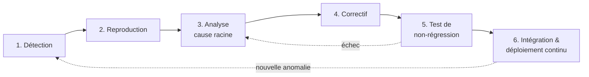
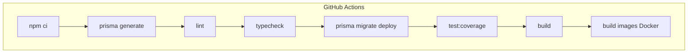

# Plan de correction des bogues — SmartBooking

> Livrable **C2.3.2** — BLOC 2 « Concevoir et développer des applications logicielles »
> Certification RNCP 39583 « Expert en développement logiciel »
> Dépôt : `github.com/Sorathia13/ynov-fil-rouge` — monorepo `backend/` + `frontend/`

## 1. Objet du document

Ce document décrit le **processus de gestion des anomalies** appliqué au projet SmartBooking, plateforme SaaS de prise de rendez-vous dont la fonctionnalité phare est le moteur de planification intelligent (*Smart Scheduling Engine*). Il couvre :

1. le **processus de qualification** d'une anomalie (matrice sévérité × priorité) ;
2. le **cycle de traitement** complet, de la détection au déploiement continu ;
3. le **registre des anomalies réellement rencontrées** durant le développement, corrigées et documentées (analyse + correctif) ;
4. pour chaque test tombé en échec, le **point d'amélioration** identifié ;
5. la **garantie de non-régression** apportée par la chaîne d'intégration continue.

Le principe directeur est le suivant : **aucune correction n'est considérée comme terminée tant qu'un test automatisé ne verrouille pas le comportement corrigé**. Le nombre de tests ne fait donc que croître au fil des corrections.

---

## 2. Processus de qualification

### 2.1 Échelle de sévérité

La **sévérité** mesure l'impact technique et métier de l'anomalie, indépendamment de la charge de correction.

| Niveau | Libellé | Définition | Exemples SmartBooking |
| --- | --- | --- | --- |
| **S1** | Bloquant | Perte de données, faille de sécurité, application inutilisable, ou atteinte à l'intégrité métier | Double-réservation concurrente d'un même créneau |
| **S2** | Critique | Fonctionnalité majeure indisponible, sans contournement acceptable | Validation d'entrée inopérante sur un endpoint |
| **S3** | Majeur | Comportement incorrect avec contournement possible | Créneaux décalés d'une heure autour d'un changement d'heure (DST) |
| **S4** | Mineur | Défaut cosmétique, confort, ou dette technique sans impact utilisateur direct | Import inutilisé, avertissement de compilation |

### 2.2 Échelle de priorité

La **priorité** ordonne les corrections dans le temps ; elle croise la sévérité avec la fréquence, la proximité d'une échéance et le périmètre affecté.

| Niveau | Libellé | Délai cible de prise en charge |
| --- | --- | --- |
| **P0** | Immédiate | Traité avant toute autre tâche ; bloque la fusion (`merge`) |
| **P1** | Haute | Traité dans l'itération courante |
| **P2** | Normale | Planifié dans une itération à venir |
| **P3** | Basse | Backlog, traité à l'occasion |

### 2.3 Matrice sévérité × priorité

La matrice fournit la priorité **par défaut** dérivée de la sévérité et de la fréquence d'occurrence ; elle est ajustable au cas par cas.

| Sévérité \ Fréquence | Rare | Occasionnelle | Fréquente / systématique |
| --- | --- | --- | --- |
| **S1 — Bloquant** | P1 | P0 | **P0** |
| **S2 — Critique** | P1 | P1 | **P0** |
| **S3 — Majeur** | P2 | P1 | **P1** |
| **S4 — Mineur** | P3 | P3 | **P2** |

**Règle absolue :** toute anomalie de sécurité (OWASP) ou d'intégrité des données est traitée **P0**, quelle que soit sa fréquence observée.

---

## 3. Cycle de traitement d'une anomalie

Le traitement suit un cycle en six phases, chacune conditionnant la suivante. Le cycle est adossé aux garde-fous automatiques du projet (ESLint, TypeScript strict, Vitest/Supertest, GitHub Actions).



### 3.1 Détection

Sources de détection mobilisées sur le projet :

- **Typecheck** (`npm run typecheck`) — TypeScript en mode strict (`noUnusedLocals`, `strictNullChecks`).
- **Lint** (`npm run lint`) — ESLint + Prettier.
- **Tests automatisés** (`npm test`) — Vitest côté domaine, Supertest côté HTTP, Testing Library côté frontend.
- **Exécution manuelle / recette** — parcours applicatifs (réservation, replanification).
- **Observabilité** — logs Winston structurés (JSON + `requestId` de corrélation), métriques Prometheus, `AuditLog`.
- **CI** — GitHub Actions rejoue l'ensemble à chaque `push`/`pull request`.

### 3.2 Reproduction

Une anomalie n'est prise en charge que si elle est **reproductible de façon déterministe**. Le moteur de planification est un **domaine pur, sans I/O, avec l'instant courant (`now`) injecté** : toute anomalie de planification est rejouable à l'identique dans un test unitaire, sans dépendance à l'horloge réelle ni à la base de données.

### 3.3 Analyse (cause racine)

L'architecture en couches (règle de dépendance orientée domaine) permet d'isoler la couche fautive :

- **`domain/`** — logique métier pure (Interval, SchedulingEngine, availability.service) ;
- **`application/`** — cas d'usage (use-cases) et DTO ;
- **`infrastructure/`** — config, Prisma, auth, implémentations de dépôts ;
- **`interface/http/`** — contrôleurs, routes, validateurs Zod, middlewares.

On recherche la **cause racine** et non le symptôme : la correction est portée dans la couche responsable.

### 3.4 Correctif

Le correctif est **minimal et ciblé**, cohérent avec les invariants du domaine (par exemple : l'adjacence de deux intervalles n'est pas un conflit — les rendez-vous dos à dos restent possibles).

### 3.5 Test de non-régression

**Chaque correctif est accompagné d'un test qui échoue avant, réussit après.** C'est la condition de clôture. Ce test rejoint le harnais permanent :

- Backend : **47 tests unitaires du domaine + 16 tests d'intégration = 63 tests** ;
- Frontend : **6 tests** ;
- **Total vérifié : 69 tests verts.**

### 3.6 Intégration et déploiement continu

La correction n'est intégrée que si l'**intégralité du pipeline** GitHub Actions passe au vert (voir §6).

---

## 4. Registre des anomalies rencontrées et corrigées

Cinq anomalies représentatives, rencontrées durant le développement puis corrigées, sont documentées ci-dessous. Chacune fait l'objet d'une fiche : contexte, symptôme, cause racine, correctif, verrou de non-régression.

### Vue d'ensemble

| Réf. | Anomalie | Couche | Sévérité | Priorité | Détectée par |
| --- | --- | --- | --- | --- | --- |
| **A** | Réassignation de `req.query` impossible sous Express | `interface/http` | S2 | P0 | Test d'intégration (Supertest) |
| **B** | Double-réservation concurrente | `infrastructure` / `domain` | S1 | P0 | Analyse de conception + test |
| **C** | Erreur TS6310 (`tsconfig` references) au typecheck | Outillage | S2 | P0 | `npm run typecheck` / CI |
| **D** | Import inutilisé bloquant le build strict | Outillage | S4 | P1 | `noUnusedLocals` / build |
| **E** | Fuseaux horaires / DST : créneaux décalés | `domain` | S3 | P1 | Test unitaire du domaine |

---

### Anomalie A — Réassignation de `req.query` impossible sous Express

| Champ | Détail |
| --- | --- |
| **Sévérité / Priorité** | S2 / P0 |
| **Couche** | `interface/http` (middleware de validation → contrôleur) |
| **Détection** | Test d'intégration HTTP (Supertest) et exécution |

**Contexte.** Le middleware de validation Zod était conçu pour parser puis **réécrire** `req.query` avec la valeur typée/nettoyée (coercition des nombres, valeurs par défaut), afin que le contrôleur consomme directement une donnée validée.

**Symptôme.** La réaffectation `req.query = parsed` est sans effet (ou déclenche une erreur) : sous Express 4, `req.query` est exposée via un **getter** (propriété calculée, non réinscriptible). Le contrôleur continuait de lire la query brute, non validée.

**Cause racine.** Hypothèse erronée sur la mutabilité de `req.query`. La stratégie « valider dans le middleware puis remplacer l'objet de requête » n'est pas applicable au champ `query` sous Express 4.

**Correctif.** La **validation des paramètres de requête a été déplacée dans le contrôleur** : le contrôleur parse explicitement `req.query` avec le schéma Zod et travaille sur le résultat typé retourné par le parse, sans jamais réécrire `req.query`. Le middleware générique `validateBody` reste utilisé pour le corps de requête, qui, lui, est réinscriptible.

```typescript
// AVANT — inopérant : req.query n'est pas réinscriptible sous Express 4
req.query = slotsQuerySchema.parse(req.query); // sans effet / lève une erreur

// APRÈS — la validation vit dans le contrôleur, sur une variable locale
const { professionalId, serviceId, from, to } =
  slotsQuerySchema.parse(req.query);
// ... la suite du contrôleur consomme uniquement ces valeurs validées
```

**Verrou de non-régression.** Test d'intégration Supertest sur `GET /appointments/slots` vérifiant qu'une query invalide renvoie une erreur de validation (`400 VALIDATION`) et qu'une query valide est correctement typée et honorée.

---

### Anomalie B — Risque de double-réservation concurrente

| Champ | Détail |
| --- | --- |
| **Sévérité / Priorité** | S1 / P0 |
| **Couche** | `infrastructure` (dépôt Prisma) adossée au `domain` |
| **Détection** | Analyse de conception (invariant métier) confortée par test |

**Contexte.** Le moteur vérifie la disponibilité d'un créneau (`checkAvailability`) avant de créer le rendez-vous. Entre la vérification et l'écriture existe une **fenêtre de concurrence** (*TOCTOU — Time-Of-Check to Time-Of-Use*).

**Symptôme.** Deux requêtes de réservation quasi simultanées sur le même créneau peuvent **toutes deux** passer la vérification de disponibilité, puis **toutes deux** créer un rendez-vous : double-réservation d'un même intervalle — violation directe de l'invariant métier central.

**Cause racine.** La vérification de disponibilité et l'écriture n'étaient pas **atomiques**. Une simple vérification applicative ne protège pas contre les écritures concurrentes.

**Correctif.** Introduction de `appointmentRepository.createIfAvailable` (et `rescheduleIfAvailable` pour la replanification), exécutés dans une **transaction Prisma en niveau d'isolation `SERIALIZABLE`**, qui **re-vérifie atomiquement le chevauchement** au sein de la transaction avant d'écrire. En cas de conflit, la réservation est refusée.

```typescript
// Ré-vérification atomique du chevauchement en transaction SERIALIZABLE
return prisma.$transaction(
  async (tx) => {
    const overlapping = await tx.appointment.findFirst({
      where: {
        professionalId,
        status: { in: ['PENDING', 'CONFIRMED'] },
        start: { lt: end },
        end: { gt: start }, // adjacence exclue : les RDV dos à dos restent permis
      },
    });
    if (overlapping) {
      throw new SlotUnavailableError(/* ... */);
    }
    return tx.appointment.create({ data: /* ... */ });
  },
  { isolationLevel: Prisma.TransactionIsolationLevel.Serializable },
);
```

Côté HTTP, le refus se traduit par une réponse **`409 SLOT_UNAVAILABLE`** dont `details.alternatives` contient la liste des créneaux alternatifs les plus proches (`start`/`end`), fournie par `suggestAlternatives`.

**Verrou de non-régression.** Test vérifiant qu'une tentative de réservation sur un créneau déjà occupé est rejetée avec `SLOT_UNAVAILABLE`, et que l'invariant de non-chevauchement (hors adjacence) est respecté.

---

### Anomalie C — Erreur TS6310 : `tsconfig` references au typecheck

| Champ | Détail |
| --- | --- |
| **Sévérité / Priorité** | S2 / P0 |
| **Couche** | Outillage (configuration TypeScript) |
| **Détection** | `npm run typecheck` en local et en CI |

**Contexte.** La configuration TypeScript reposait initialement sur des **project references** (`tsconfig` avec `references`), pensées pour un découpage multi-projets.

**Symptôme.** Le typecheck échouait avec l'erreur **`TS6310: Referenced project may not disable emit`** (un projet référencé ne peut pas désactiver l'émission avec `noEmit`), bloquant l'étape `typecheck` du pipeline.

**Cause racine.** Incompatibilité entre l'usage de `references` (qui impose des contraintes d'émission — `composite`, pas de `noEmit`) et la configuration `noEmit` utilisée pour le simple contrôle de types. Le montage en projets référencés n'était pas nécessaire au périmètre réel du backend.

**Correctif.** Passage à une **configuration TypeScript unique** (suppression des `references`), alignée sur les besoins du projet : un seul `tsconfig` pilote le typecheck en `noEmit`, sans contrainte de projet composite.

**Verrou de non-régression.** L'étape `typecheck` de la CI joue le rôle de garde permanent : toute réintroduction d'une configuration invalide fait à nouveau échouer le pipeline.

---

### Anomalie D — Import inutilisé bloquant le build strict

| Champ | Détail |
| --- | --- |
| **Sévérité / Priorité** | S4 / P1 |
| **Couche** | Outillage (compilation TypeScript strict) |
| **Détection** | `noUnusedLocals` (TypeScript strict) et étape `build` |

**Contexte.** Le projet compile en **TypeScript strict**, avec `noUnusedLocals` activé.

**Symptôme.** La présence d'un **import inutilisé** (résidu de refactorisation) provoquait l'échec de la compilation, donc de l'étape `build`.

**Cause racine.** Code mort laissé après une refactorisation ; en mode strict, ce n'est pas un simple avertissement mais une **erreur bloquante** — comportement voulu, gage de propreté du code.

**Correctif.** **Nettoyage** de l'import inutilisé. Plus largement, le mode strict est conservé tel quel : il transforme la dette de propreté en erreur détectée au plus tôt.

**Verrou de non-régression.** Les étapes `lint` et `build` de la CI garantissent qu'aucun code mort de ce type ne peut être fusionné.

---

### Anomalie E — Fuseaux horaires / DST : créneaux décalés

| Champ | Détail |
| --- | --- |
| **Sévérité / Priorité** | S3 / P1 |
| **Couche** | `domain` (`availability.service`) |
| **Détection** | Test unitaire du domaine (déterministe, `now` injecté) |

**Contexte.** Les horaires d'ouverture sont exprimés en **heure locale** (`WorkingHours` : `weekday` 0-6, minutes depuis minuit), tandis que les rendez-vous sont stockés en **UTC** (`Interval` en millisecondes epoch). `expandWorkingHours` convertit les horaires hebdomadaires récurrents en intervalles UTC concrets.

**Symptôme.** Autour d'un **changement d'heure (DST)** — passage heure d'été/hiver sur `Europe/Paris` — les créneaux générés étaient **décalés d'une heure** : le décalage UTC (`+01:00` / `+02:00`) n'était pas celui du jour considéré.

**Cause racine.** Le parcours des jours s'appuyait sur une progression temporelle (par exemple avancer de 24 h, ou ancrer le calcul à minuit) qui **traverse la discontinuité DST** : le jour du changement ne compte pas 24 heures, et minuit peut être ambigu ou inexistant selon la transition, ce qui fausse la conversion heure locale → UTC.

**Correctif.** **Ancrage à midi** lors du parcours des jours : chaque jour est repéré par son **midi local**, point **stable et non ambigu** (jamais concerné par les sauts DST, qui se produisent aux heures nocturnes/matinales). La conversion heure locale ↔ UTC utilise `Intl.DateTimeFormat` pour obtenir le décalage effectif du jour, appliqué ensuite aux bornes réelles des horaires d'ouverture.

**Verrou de non-régression.** Tests unitaires du domaine couvrant explicitement les journées de transition DST (bascule été→hiver et hiver→été sur `Europe/Paris`), vérifiant que les intervalles UTC produits correspondent aux heures locales attendues. Le domaine étant pur et `now` injecté, ces cas sont rejoués de façon **déterministe**, sans dépendre de la date d'exécution.

---

## 5. Tests en échec — analyse du point d'amélioration

Chaque anomalie ci-dessus a été verrouillée par un test (ou une étape de la chaîne de qualité) qui **échouait avant correction**. Le tableau suivant relie chaque échec au **point d'amélioration** qu'il a mis en lumière — c'est-à-dire la faiblesse de conception ou d'hypothèse que le test a permis de corriger durablement.

| Réf. | Étape/test en échec | Ce que l'échec révélait | Point d'amélioration retenu |
| --- | --- | --- | --- |
| **A** | Test d'intégration `GET /appointments/slots` : query non validée atteignait le contrôleur | Hypothèse fausse sur la mutabilité de `req.query` (getter Express 4) | Valider la query **là où elle est consommée** (contrôleur), ne pas réécrire un champ non réinscriptible ; réserver `validateBody` au corps de requête |
| **B** | Test de réservation concurrente : deux créations acceptées sur le même créneau | Vérification de disponibilité **non atomique** (TOCTOU) | Rendre la garde **atomique** : re-vérification du chevauchement en transaction `SERIALIZABLE`, source unique de vérité pour l'invariant |
| **C** | Étape `typecheck` : `TS6310` | Sur-conception de l'outillage (project references superflues) au regard du périmètre | Privilégier la **configuration la plus simple qui satisfait le besoin** ; un seul `tsconfig` en `noEmit` |
| **D** | Étape `build` : erreur `noUnusedLocals` | Code mort échappé à une refactorisation | Conserver le **strict** comme filet ; le build échoue plutôt que de laisser passer la dette |
| **E** | Test du domaine sur journées DST : créneaux décalés d'une heure | Le parcours des jours **traversait la discontinuité DST** | **Ancrer à midi** (point stable) et dériver le décalage UTC réel du jour via `Intl.DateTimeFormat` |

**Enseignement transversal.** Les échecs se répartissent en deux familles complémentaires, toutes deux couvertes :

- **Échecs statiques** (C, D) — captés par `typecheck`/`lint`/`build` : ils protègent la **santé du code** et sont détectés avant toute exécution.
- **Échecs dynamiques** (A, B, E) — captés par les tests unitaires et d'intégration : ils protègent le **comportement métier**, dont l'invariant central de non-double-réservation et la justesse des créneaux.

Le caractère **déterministe** du domaine (I/O absent, `now` injecté) est le facteur qui rend ces échecs reproductibles, donc corrigeables une fois pour toutes.

---

## 6. Garantie de non-régression par la CI

Chaque correction rejoint un **harnais permanent** rejoué automatiquement par **GitHub Actions** à chaque `push` et `pull request`. Un correctif ne peut être fusionné que si l'intégralité du pipeline passe au vert ; un test de non-régression réintroduit ainsi ne peut plus « re-échouer » silencieusement.

### 6.1 Étapes du pipeline



| Job | Rôle | Anomalies verrouillées |
| --- | --- | --- |
| **backend** (service Postgres) | `npm ci`, `prisma generate`, `lint`, `typecheck`, `prisma migrate deploy`, `test:coverage`, `build` | A, B, C, D, E |
| **frontend** | `npm ci`, `lint`, `typecheck`, `test`, `build` | 6 tests Testing Library |
| **docker** | Construction des images (API multi-stage, web nginx) | Intégrité de la conteneurisation |

Le pipeline utilise `concurrency` avec `cancel-in-progress` afin d'annuler les exécutions obsolètes et de conserver un résultat de référence toujours à jour.

### 6.2 Pourquoi la non-régression est garantie

1. **Verrou systématique** — chaque anomalie corrigée (§4) est doublée d'un test ou d'une étape statique qui échouait avant correction : sa réapparition rouvrirait l'échec.
2. **Barrière de fusion** — `lint`, `typecheck`, `test:coverage` et `build` doivent tous réussir ; une régression bloque la fusion.
3. **Reproductibilité** — `npm ci` s'appuie sur les *lockfiles* (dépendances épinglées) et `prisma migrate deploy` applique un schéma déterministe : la CI rejoue un environnement identique à chaque exécution.
4. **Déterminisme du domaine** — le moteur de planification étant pur avec `now` injecté, les tests critiques (concurrence, DST, disponibilité) ne dépendent ni de l'horloge ni de l'ordre d'exécution.
5. **Couverture métier de bout en bout** — 63 tests backend (47 unitaires + 16 d'intégration) et 6 tests frontend, soit **69 tests verts**, exécutés à chaque itération.

### 6.3 État de référence

| Indicateur | Valeur vérifiée |
| --- | --- |
| Tests unitaires backend (domaine) | 47 |
| Tests d'intégration backend | 16 |
| Tests frontend | 6 |
| **Total** | **69 tests verts** |
| Étapes bloquantes avant fusion | lint, typecheck, test:coverage, build |

**Conclusion.** Le plan de correction des bogues de SmartBooking repose sur un principe non négociable : **toute anomalie corrigée devient un test permanent**. Couplé à un pipeline d'intégration continue qui bloque la fusion au moindre échec, à un domaine métier déterministe et à une configuration reproductible, ce principe garantit qu'aucune des anomalies documentées — de la double-réservation concurrente au décalage DST — ne peut réapparaître sans être immédiatement détectée par la chaîne de qualité.
