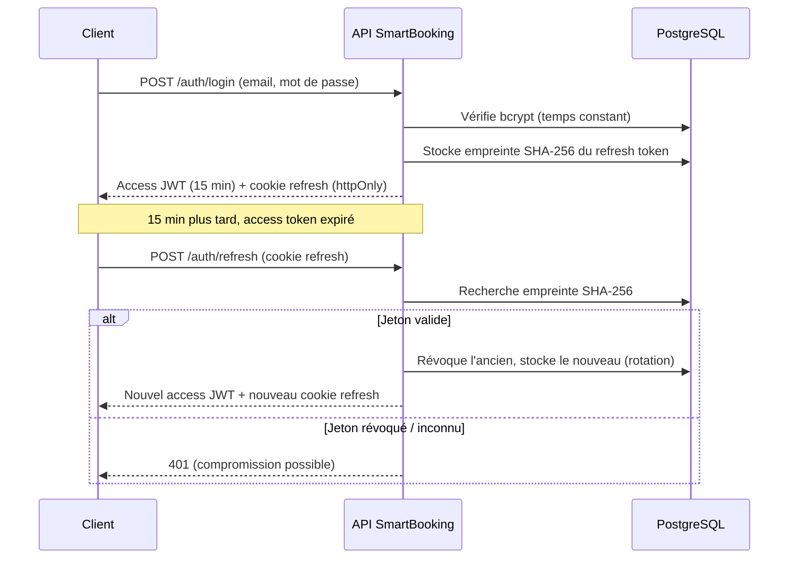
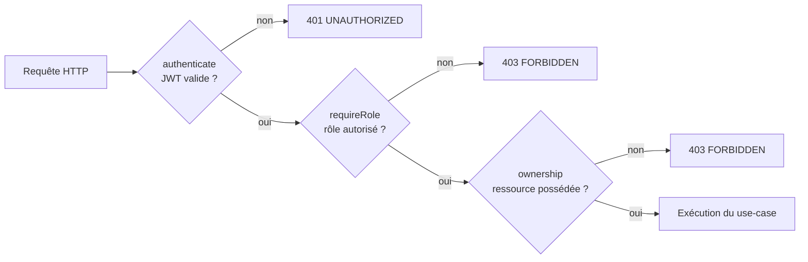
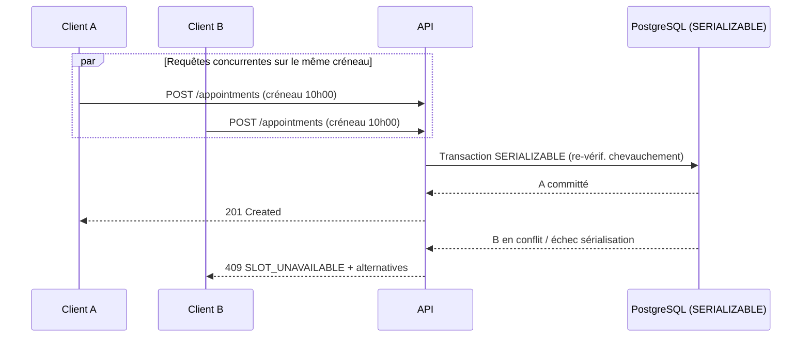

# Mesures de sécurité

> **Compétence visée : C2.2.3 — Sécurité (bloc éliminatoire)**
> Certification RNCP 39583 « Expert en développement logiciel » — BLOC 2 « Concevoir et développer des applications logicielles ».
> Projet **SmartBooking** — plateforme SaaS de prise de rendez-vous intelligente.

---

## 1. Introduction

La sécurité de SmartBooking n'est pas un module ajouté après coup : elle est **intégrée dès la conception** (*security by design*) et distribuée sur toutes les couches de l'architecture *clean* du backend (`domain`, `application`, `infrastructure`, `interface/http`). Chaque décision est motivée par une menace concrète et référencée au **standard OWASP Top 10 (édition 2021)**, qui sert de grille d'analyse de bout en bout.

Les principes directeurs appliqués sont les suivants :

| Principe | Traduction concrète dans SmartBooking |
| --- | --- |
| **Défense en profondeur** | Plusieurs contrôles indépendants pour une même menace (ex. anti-double-réservation : validation métier *et* garde transactionnelle `SERIALIZABLE`). |
| **Moindre privilège** | RBAC à trois rôles + vérifications de propriété (*ownership*) ; conteneur Docker exécuté en utilisateur non-root `node`. |
| **Fail-fast / fail-secure** | Configuration validée par Zod au démarrage ; l'application refuse de démarrer si un secret est absent ou faible en production. |
| **Validation systématique** | Toute entrée HTTP est validée par un schéma Zod avant d'atteindre la logique métier. |
| **Traçabilité** | Journalisation structurée (Winston) corrélée par `requestId`, `AuditLog` en base, métriques Prometheus. |
| **Surface minimale** | Images Docker `alpine`, `x-powered-by` désactivé, dépendances épinglées, aucune donnée sensible exposée par les API publiques. |

La suite du document présente d'abord la **couverture complète du OWASP Top 10 2021** sous forme de tableau de synthèse, puis détaille chaque grand chantier de sécurité, avant d'exposer honnêtement les **limites connues et les pistes d'amélioration**.

---

## 2. Couverture OWASP Top 10 2021 — tableau de synthèse

Le tableau ci-dessous couvre **explicitement les dix catégories** A01 à A10. Il fait le lien entre la faille théorique, sa description, la mesure réellement implémentée dans SmartBooking, et le fichier ou mécanisme porteur.

| Faille OWASP 2021 | Description | Mesure mise en œuvre dans SmartBooking | Fichier / mécanisme |
| --- | --- | --- | --- |
| **A01 – Broken Access Control** | Contrôle d'accès défaillant : un utilisateur accède à des ressources ou actions hors de ses droits. | **RBAC** à trois rôles (`CLIENT` / `PRO` / `ADMIN`) via le middleware `requireRole`, complété par des **vérifications de propriété** (*ownership*) : un client ne voit que ses rendez-vous, un pro ne modifie que son propre profil. | `interface/http/middlewares` (`authenticate`, `requireRole`) ; contrôles d'ownership dans `application/use-cases` (ex. `AppointmentService`, `ProfessionalService`). |
| **A02 – Cryptographic Failures** | Protection insuffisante des données sensibles (mots de passe, jetons) au repos ou en transit. | Mots de passe hachés avec **bcrypt (coût 12)** ; **refresh tokens opaques hachés en SHA-256** avant stockage (jamais en clair en base) ; cookie **`httpOnly` / `secure` / `sameSite`** ; JWT signés. | `infrastructure/auth` (hachage bcrypt, jetons opaques et JWT) ; modèle `RefreshToken` (Prisma). |
| **A03 – Injection** | Injection SQL, NoSQL, commande… via des entrées non assainies. | **Requêtes 100 % paramétrées via Prisma** (aucune concaténation SQL) + **validation Zod** de toutes les entrées avant traitement. | `infrastructure/prisma` (client Prisma) ; `interface/http/validators` (schémas Zod) ; middleware `validateBody`. |
| **A04 – Insecure Design** | Défauts de conception, absence de garde-fous métier. | **Architecture en couches** (règle de dépendance vers le domaine) isolant la logique métier ; **délai de prévenance** (*lead time*) ; garde d'atomicité **transaction `SERIALIZABLE`** contre les *race conditions* de réservation. | `domain/` (moteur pur sans I/O) ; `appointmentRepository.createIfAvailable` / `rescheduleIfAvailable`. |
| **A05 – Security Misconfiguration** | Mauvaise configuration : en-têtes manquants, valeurs par défaut, secrets faibles. | **Helmet** (en-têtes de sécurité HTTP) ; **`x-powered-by` désactivé** ; **CORS en liste blanche** ; **configuration validée par Zod au démarrage** avec *fail-fast* et garde des secrets en production. | `infrastructure/config` (env validé Zod) ; `interface/http` (Helmet, CORS) ; nginx (en-têtes de sécurité côté frontend). |
| **A06 – Vulnerable and Outdated Components** | Utilisation de composants vulnérables ou obsolètes. | **Dépendances épinglées** et installées via `npm ci` (lockfiles) ; **images Docker `node:22-alpine` minimales** ; build multi-stage réduisant la surface. | `package-lock.json` ; `Dockerfile` (multi-stage, `alpine`). |
| **A07 – Identification and Authentication Failures** | Faiblesses d'authentification (force brute, jetons non révoqués, énumération de comptes). | **Rate limiting** (global + strict sur l'authentification) ; **rotation et révocation des refresh tokens** ; **message de login uniforme** (anti-énumération) ; **comparaison à temps constant** des hachages. | `interface/http/middlewares` (rate-limit) ; `application/use-cases/AuthService` ; `infrastructure/auth`. |
| **A08 – Software and Data Integrity Failures** | Intégrité non vérifiée du code, des dépendances ou du pipeline CI/CD. | **CI GitHub Actions** (lint, typecheck, migrate, tests, build) + **lockfiles** installés en `npm ci` garantissant des builds reproductibles. | `.github/workflows` (jobs backend / frontend / docker) ; `package-lock.json`. |
| **A09 – Security Logging and Monitoring Failures** | Absence de journalisation/supervision empêchant la détection d'incidents. | **Logs Winston structurés** (JSON en prod) corrélés par **`requestId`** ; **métriques Prometheus** (`/metrics`) ; **`AuditLog`** en base pour les actions sensibles ; health checks. | `infrastructure/logging` (Winston) ; `interface/http/metrics` (prom-client) ; modèle `AuditLog`. |
| **A10 – Server-Side Request Forgery (SSRF)** | Le serveur émet des requêtes vers des URL contrôlées par l'utilisateur. | **Aucune récupération d'URL fournie par l'utilisateur côté serveur** : le backend n'effectue pas de requête sortante pilotée par une entrée utilisateur, supprimant la surface SSRF. | Choix d'architecture (pas de *fetch* d'URL utilisateur dans `application` / `infrastructure`). |

---

## 3. Authentification

L'authentification repose sur un schéma **JWT à durée courte + refresh token rotatif**, conçu pour limiter la fenêtre d'exploitation d'un jeton volé.

### 3.1 Jetons

| Jeton | Type | Durée | Stockage | Rôle |
| --- | --- | --- | --- | --- |
| **Access token** | JWT signé | **15 minutes** | En mémoire côté client / en-tête `Authorization` | Autorise les appels API. Courte durée = fenêtre d'attaque réduite. |
| **Refresh token** | Opaque (aléatoire) | Longue | **Haché SHA-256 en base**, transmis via **cookie `httpOnly` / `secure` / `sameSite`** | Renouvelle l'access token. **Rotatif** : chaque usage émet un nouveau jeton et invalide l'ancien. |

**Points clés :**

- Le refresh token est **opaque** (pas un JWT) : il ne contient aucune donnée exploitable et n'a de valeur que par correspondance avec l'empreinte stockée.
- Il n'est **jamais stocké en clair** : seule son empreinte **SHA-256** est persistée (modèle `RefreshToken`). Une fuite de la base ne révèle pas les jetons.
- La **rotation** détecte le rejeu : réutiliser un ancien refresh token révoqué signale une compromission possible.
- Le cookie `httpOnly` empêche l'accès JavaScript (mitige le vol par XSS), `secure` impose HTTPS, `sameSite` limite le CSRF.

### 3.2 Mots de passe

- Hachage **bcrypt avec coût 12** (`infrastructure/auth`) : coût calculatoire volontairement élevé contre les attaques par force brute hors ligne.
- **Comparaison à temps constant** lors de la vérification, pour ne pas révéler d'information par analyse temporelle.
- Comptes de démonstration : `admin@`, `pro@`, `client@smartbooking.dev`, mot de passe `Password123!` (environnement de démonstration uniquement).

### 3.3 Flux de rafraîchissement (rotation)



---

## 4. Autorisation (RBAC + ownership)

L'autorisation combine **deux niveaux complémentaires** afin d'éviter les angles morts du contrôle d'accès (A01).

1. **RBAC (Role-Based Access Control)** — trois rôles hiérarchisés :

   | Rôle | Périmètre |
   | --- | --- |
   | `CLIENT` | Réserve, consulte et annule **ses** rendez-vous. |
   | `PRO` | Gère **son** profil, ses services, ses horaires, ses indisponibilités et les rendez-vous **le concernant**. |
   | `ADMIN` | Administration transverse (`GET /users`, `PATCH /users/:id`). |

2. **Vérification de propriété (*ownership*)** — au-delà du rôle, l'application vérifie que la ressource **appartient bien** à l'utilisateur appelant. Un `PRO` ne peut pas modifier le profil d'un autre professionnel, un `CLIENT` ne peut pas consulter le rendez-vous d'un tiers.

Le middleware `requireRole` filtre par rôle au niveau de la route ; les *use-cases* de la couche `application` (ex. `AppointmentService`, `ProfessionalService`) appliquent ensuite le contrôle d'ownership au plus près de la logique métier.



---

## 5. Validation des entrées (Zod)

Toute donnée entrante (corps de requête, paramètres) est **validée par un schéma Zod** avant d'atteindre la logique métier — première ligne de défense contre l'injection (A03) et les données malformées.

- Schémas centralisés dans `interface/http/validators`.
- Middleware `validateBody` : rejette toute requête non conforme avec un `400 VALIDATION` détaillé.
- **Double emploi de Zod** : côté HTTP (validation des entrées) *et* côté configuration (`infrastructure/config`, validation de l'environnement au démarrage).
- Le frontend utilise également **React Hook Form + Zod**, mais la **validation serveur reste l'autorité** : le client ne fait jamais foi.

```typescript
// interface/http/validators — exemple de schéma Zod
const bookAppointmentSchema = z.object({
  serviceId: z.string().uuid(),
  start: z.string().datetime(),   // ISO 8601 strict
});

// interface/http/middlewares/validateBody
export const validateBody =
  (schema: ZodSchema) =>
  (req, _res, next) => {
    const result = schema.safeParse(req.body);
    if (!result.success) {
      throw new ValidationError(result.error.flatten());
    }
    req.body = result.data; // données typées et assainies
    next();
  };
```

---

## 6. En-têtes & configuration

### 6.1 En-têtes de sécurité

- **Helmet** applique un jeu d'en-têtes HTTP de sécurité sur l'API.
- **`x-powered-by` désactivé** : ne révèle pas la technologie serveur (réduction de l'empreinte d'attaque).
- **nginx** (frontend) ajoute ses propres **en-têtes de sécurité**, sert la SPA avec *fallback* et **proxifie `/api`** vers l'API.

### 6.2 CORS

- **Liste blanche d'origines** : seules les origines explicitement autorisées peuvent appeler l'API. Aucune ouverture `*` en production.

### 6.3 Configuration & secrets (*fail-fast*)

La configuration est **validée par Zod au démarrage** (`infrastructure/config`) :

- Variables manquantes ou mal typées → **l'application refuse de démarrer** (*fail-fast*).
- **Garde des secrets en production** : un secret absent ou trop faible bloque le démarrage, empêchant tout déploiement non sécurisé.
- Aucun secret n'est codé en dur : ils proviennent exclusivement de l'environnement.

```typescript
// infrastructure/config — validation fail-fast de l'environnement
const envSchema = z.object({
  NODE_ENV: z.enum(['development', 'test', 'production']),
  DATABASE_URL: z.string().url(),
  JWT_SECRET: z.string().min(32),   // garde secret : rejet si trop faible
  // …
});

const parsed = envSchema.safeParse(process.env);
if (!parsed.success) {
  // Échec au démarrage : aucun déploiement non sécurisé possible
  throw new Error('Configuration invalide : ' + parsed.error.message);
}
export const env = parsed.data;
```

---

## 7. Limitation de débit (rate limiting)

Le *rate limiting* protège contre la **force brute** et le **déni de service applicatif** (A07).

| Portée | Cible | Objectif |
| --- | --- | --- |
| **Globale** | Ensemble des routes API | Limiter l'abus général et absorber les pics anormaux. |
| **Stricte (auth)** | `POST /auth/login`, `/auth/register`, `/auth/refresh` | Ralentir fortement les tentatives de force brute sur les identifiants. |

Middleware `rate-limit` dans `interface/http/middlewares`. Combiné au **message de login uniforme** et à la **comparaison à temps constant**, il neutralise à la fois la force brute et l'**énumération de comptes**.

---

## 8. Protection anti-double-réservation (transaction SERIALIZABLE)

Le **Smart Scheduling Engine** empêche les doubles réservations à **deux niveaux**, illustrant la défense en profondeur face à un défaut de conception (A04) :

1. **Validation métier (domaine pur)** — `SchedulingEngine.checkAvailability` vérifie la disponibilité (créneau passé, délai de prévenance, hors horaires, indisponibilité, conflit) *avant* toute écriture. Le domaine est **sans I/O** et le `now` est **injecté**, donc **déterministe et testable**.

2. **Garde transactionnelle atomique** — l'écriture réelle passe par `appointmentRepository.createIfAvailable` (et `rescheduleIfAvailable`), exécutée dans une **transaction Prisma en isolation `SERIALIZABLE`** qui **re-vérifie atomiquement le chevauchement**. Ceci élimine la *race condition* où deux requêtes concurrentes valideraient le même créneau libre au même instant.

> **Rappel de règle métier :** l'adjacence n'est **pas** un conflit — deux rendez-vous dos à dos sont autorisés (`Interval.overlaps`).

En cas de créneau devenu indisponible, l'API répond **`409 SLOT_UNAVAILABLE`** avec, dans `details.alternatives`, la liste des créneaux de remplacement les plus proches (`start` / `end`) — le moteur propose automatiquement les alternatives triées par distance à l'heure désirée.



---

## 9. Gestion d'erreurs sans fuite d'information

La gestion d'erreurs est **centralisée** et conçue pour **ne jamais divulguer d'information sensible** (stack trace, structure interne, existence d'un compte).

- Hiérarchie d'erreurs typées dans `domain/errors` : `AppError` → `NotFound`, `Conflict`, `Validation`, `Unauthorized`, `Forbidden`, `SlotUnavailable`.
- Middleware `errorHandler` unique : convertit chaque erreur en une réponse HTTP normalisée.
- **Format d'erreur uniforme** exposé au client :

  ```json
  {
    "error": {
      "code": "SLOT_UNAVAILABLE",
      "message": "Le créneau demandé n'est plus disponible.",
      "details": {
        "alternatives": [
          { "start": "2026-07-25T09:00:00.000Z", "end": "2026-07-25T09:30:00.000Z" }
        ]
      }
    }
  }
  ```

- **Message de login uniforme** : identifiants invalides et compte inexistant renvoient le **même message**, empêchant l'énumération de comptes.
- Les détails techniques (stack, requêtes SQL) restent **dans les logs serveur** (Winston), jamais dans la réponse client.

---

## 10. Journalisation & supervision

La traçabilité répond directement à A09 (*Logging & Monitoring Failures*) et alimente la détection d'incidents.

| Dispositif | Détail | Emplacement |
| --- | --- | --- |
| **Logs structurés** | **Winston** — JSON en production, corrélation par **`requestId`** (middleware `requestLogger`). | `infrastructure/logging` |
| **Métriques** | **Prometheus** via `prom-client` sur `/metrics` : `http_request_duration_seconds`, `http_requests_total`, métriques process par défaut. | `interface/http/metrics` |
| **Piste d'audit** | Modèle **`AuditLog`** en base pour les actions sensibles. | Prisma / PostgreSQL |
| **Health checks** | `/health` (liveness) et `/health/ready` (readiness, ping DB). | `interface/http` |
| **Visualisation** | **Grafana** (profil `monitoring` de `docker-compose`). | `docker-compose` |

Le `requestId` permet de **corréler** une requête client, ses logs et ses métriques de bout en bout — essentiel pour l'analyse post-incident.

---

## 11. Limites connues et pistes d'amélioration

La sécurité est un processus continu. Les éléments suivants sont **identifiés mais non encore implémentés**, et constituent la feuille de route de durcissement :

| Piste | Objectif | Bénéfice attendu |
| --- | --- | --- |
| **Dependabot** (ou Renovate) | Automatiser la détection et la mise à jour des dépendances vulnérables. | Renforce A06 : réduit la fenêtre d'exposition aux CVE des composants tiers. |
| **Scan SAST** (ex. CodeQL, Semgrep) | Analyse statique du code source intégrée à la CI GitHub Actions. | Détecte automatiquement les motifs vulnérables avant le *merge*. |
| **Authentification à deux facteurs (2FA)** | Second facteur (TOTP) sur l'authentification, en priorité pour le rôle `ADMIN`. | Renforce A07 : protège même en cas de compromission du mot de passe. |

**Autres pistes complémentaires envisageables :** scan des images Docker (Trivy), rotation planifiée des secrets, alerting Grafana sur seuils de métriques, et politique de mot de passe renforcée (longueur, entropie).

---

### Synthèse

SmartBooking couvre **l'intégralité du OWASP Top 10 2021 (A01–A10)** par des mesures concrètes et vérifiables, réparties en couches selon le principe de **défense en profondeur** : authentification robuste (JWT court + refresh rotatif haché, bcrypt 12), autorisation à deux niveaux (RBAC + ownership), validation systématique (Zod), configuration *fail-fast*, limitation de débit, garde d'atomicité `SERIALIZABLE` contre la double-réservation, gestion d'erreurs sans fuite et journalisation corrélée. Les limites sont assumées et documentées, avec une feuille de route de durcissement claire (Dependabot, SAST, 2FA).
